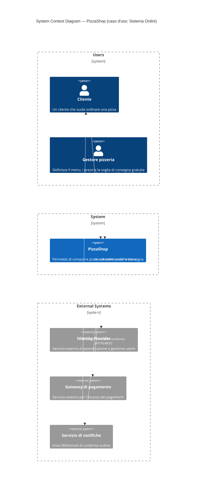

# Livello 1 — System Context Diagram

> **Caso d'uso**: composizione di un ordine e calcolo del totale (vedi [README](README.md#il-caso-duso-scelto-per-la-demo)).

Vista più esterna: il sistema "PizzaShop" trattato come un'unica scatola nera, con le persone che lo usano e gli
eventuali sistemi esterni con cui si integra. I termini strutturali del C4 Model (title, boundary) restano in
inglese, come da convenzione consolidata; i nomi di dominio (Cliente, Gestore pizzeria, ecc.) restano in italiano,
coerentemente con il resto del progetto (feature Gherkin in italiano).

## Note di lettura
- `Person(...)`: un attore umano.
- `System(...)`: il sistema che stiamo documentando (in grassetto/evidenziato nei renderer che lo supportano).
- `System_Ext(...)`: un sistema esterno, non sviluppato/gestito da noi.
- `Rel(...)`: una relazione/interazione, con un'etichetta e (opzionalmente) il protocollo usato.
- `Boundary(...) { ... }`: raggruppa più elementi in un contenitore logico (qui "Users", "System" ed "External
  Systems"), usato solo per influenzare il layout e ottenere una disposizione a livelli (utenti sopra, sistema
  al centro, servizi sotto), simile allo stile degli esempi ufficiali su [c4model.com](https://c4model.com). Il
  boundary "System" contiene un solo elemento: serve solo a "impilarlo" nella riga di mezzo insieme agli altri
  due gruppi, non introduce un vero confine architetturale nel nostro caso, è solo un aiuto grafico.
- `UpdateLayoutConfig(...)`: suggerisce all'algoritmo di layout quanti elementi disporre per riga prima di
  andare a capo (qui un numero alto, così tutti gli elementi di uno stesso boundary restano affiancati sulla
  stessa riga orizzontale invece di impilarsi verticalmente).
- `UpdateRelStyle(...)`: personalizza colore testo/linea di una singola relazione (qui bianco, per restare
  leggibile su sfondo scuro) e può spostare leggermente l'etichetta con `$offsetX`/`$offsetY` quando due
  etichette rischiano di sovrapporsi.
- **Perché la freccia di `notifiche` punta solo al `Cliente` e non anche al `Gestore pizzeria`**: nel boundary
  "Users" ci sono due persone, ma la conferma d'ordine (SMS/email) ha senso solo per chi l'ordine lo ha fatto,
  cioè il Cliente. Non è quindi un caso di "relazione verso più persone da disambiguare": semplicemente il
  Gestore non è un destinatario di questa specifica interazione, quindi non compare nessuna relazione verso di
  lui in questo punto del diagramma. In generale, in C4/Mermaid ogni `Rel(...)` collega sempre **due** nodi
  precisi: se un sistema dovesse davvero notificare più destinatari distinti, si aggiungerebbe una `Rel(...)`
  separata per ciascun destinatario (non è un problema avere più frecce in uscita dallo stesso nodo).

## Cosa è realmente implementato nella demo
Nel codice della solution, `identityProvider`, `gatewayPagamenti` e `notifiche` **non esistono ancora**: fanno
parte del design del sistema ma restano da realizzare. L'unica parte con logica di business già implementata è
`pizzaShop` (nella libreria `PizzaShop.Domain`), rappresentata nel dettaglio nel
[diagramma di livello Container](02-container-diagram.md), che riporta anche una tabella con lo stato di
implementazione di ciascun elemento.
