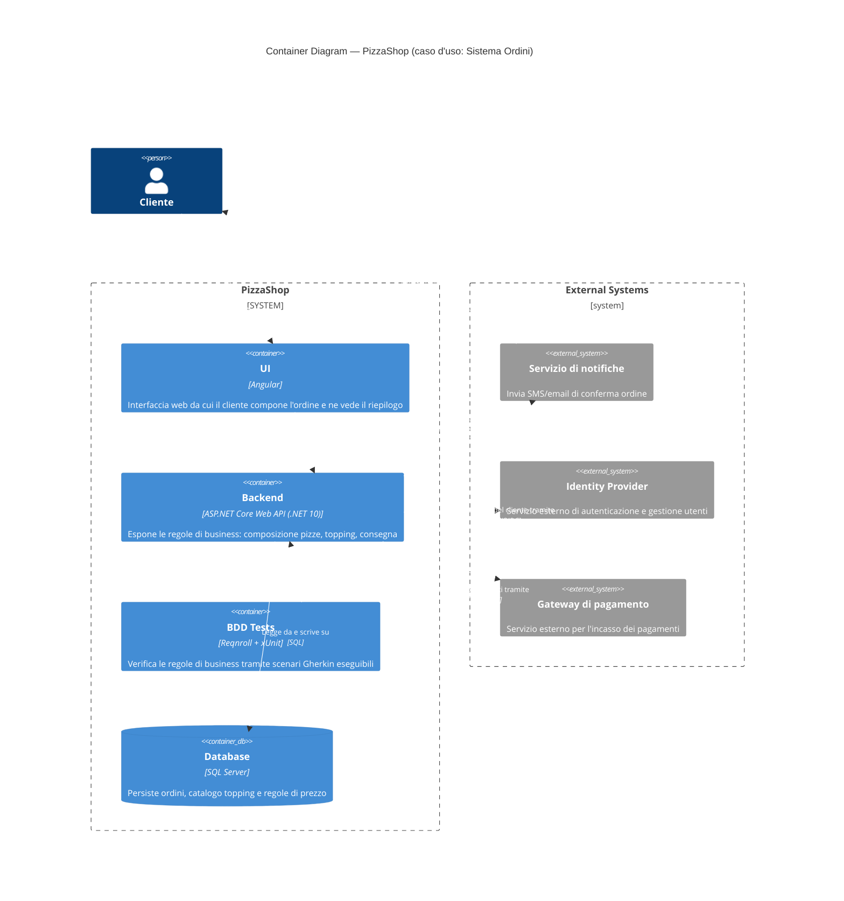

# Livello 2 — Container Diagram

> **Caso d'uso**: composizione di un ordine e calcolo del totale (vedi [README](README.md#il-caso-duso-scelto-per-la-demo)).

Si "apre" il sistema `PizzaShop` e se ne mostrano i container: le unità eseguibili/deployabili che lo compongono.
A differenza del [Context Diagram](01-system-context.md), qui compaiono **solo gli attori/sistemi esterni che
hanno effettivamente una relazione** con un container del caso d'uso mostrato: il **Gestore pizzeria** non compare
perché la sua interazione (configurare menu e sconti) è un caso d'uso diverso da "Sistema Ordini" e non tocca
nessuno dei container qui rappresentati. I sistemi esterni, invece, restano visibili perché il flusso di
composizione ordine li coinvolgerebbe (autenticazione, incasso e conferma), e sono raggruppati in un boundary a
parte per distinguerli chiaramente dal sistema PizzaShop, come nel Context Diagram.

> **Nota**: questo documento descrive il **design** del sistema PizzaShop così come lo si progetterebbe per il
> caso d'uso "Sistema Ordini", non solo ciò che è già scritto nella solution demo — è normale e atteso che un
> diagramma C4 anticipi container non ancora implementati (qui UI e Backend). Il dettaglio di cosa esiste già nel
> codice della demo e cosa è ancora da realizzare è riportato in fondo, nella tabella "Corrispondenza con la
> solution", per non appesantire il diagramma stesso.

## Note di lettura
- `System_Boundary(...)`: il confine del sistema `PizzaShop`, dentro cui vivono i container mostrati.
- `Container(...)` / `ContainerDb(...)`: un'unità deployabile/eseguibile separatamente, con la sua tecnologia
  indicata tra parentesi. `ContainerDb` è la variante grafica pensata per i database (icona a cilindro).
- **UI** e **Backend** sono qui descritti con le tecnologie con cui verrebbero realizzati (Angular e ASP.NET Core
  Web API): il [Component Diagram](03-component-diagram.md) scompone il Backend nei suoi componenti, distinguendo
  quelli già implementati nella demo da quelli ancora da realizzare.
- Il **Gestore pizzeria** non compare in questo diagramma: a livello Container si mostrano solo gli attori/sistemi
  che interagiscono con almeno un container del caso d'uso rappresentato. Il Gestore resta visibile nel
  [Context Diagram](01-system-context.md), dove la sua relazione con il sistema PizzaShop nel suo complesso è
  pertinente.
- `Boundary(servizi, "External Systems") { ... }`: raggruppa i sistemi esterni in un contenitore logico separato
  dal System_Boundary di PizzaShop, solo per chiarezza visiva (stesso pattern usato nel Context Diagram).
- **Identity Provider**: gestisce l'autenticazione del cliente. Compare qui perché qualunque azione del caso
  d'uso (comporre un ordine) presuppone un cliente autenticato; il suo utilizzo concreto (validazione token, ecc.)
  è dettagliato nel [Component Diagram](03-component-diagram.md).
- **Servizio di notifiche**: come nell'esempio ufficiale di [c4model.com](https://c4model.com) (il sistema email
  che notifica direttamente il cliente), la conferma dell'ordine non torna al cliente passando dal Backend/UI, ma
  viene inviata **direttamente** dal servizio di notifiche (relazione `notifiche → cliente`). Per questo è
  dichiarato per primo nel boundary "External Systems": il layout automatico lo posiziona più in alto, vicino al
  cliente, cosicché la freccia di ritorno non debba attraversare gli altri container.
- Le relazioni tra `ui`, `testBdd` e `backend` rappresentano l'interazione applicativa reale (nella demo attuale
  avviene in-process anziché via rete, essendo la UI e il Backend ancora da realizzare separatamente). Le
  relazioni verso `identityProvider`, `gatewayPagamenti`, `notifiche` e `database` mostrano invece le
  integrazioni previste dal design, anche se non ancora implementate nel codice della demo.
- `UpdateRelStyle(...)`: forza il colore di testo e linea delle relazioni in bianco (leggibili su sfondo scuro) e
  sposta le etichette con `$offsetX`/`$offsetY` per evitare che si sovrappongano ai box degli External Systems, al
  box del Backend o tra loro quando più frecce condividono lo stesso nodo.

## Corrispondenza con la solution
| Container/sistema nel diagramma | Stato nella solution attuale |
|---|---|
| UI (Angular) | Non ancora implementata; il ruolo è simulato da `GherkinCucumberDemo.csproj` (console app) |
| Backend (ASP.NET Core Web API) | Non ancora implementato come API; la logica di business esiste già in `PizzaShop.Domain`, richiamata in-process |
| BDD Tests | Implementato: `PizzaShop.Bdd.Tests` |
| Database (SQL Server) | Non implementato: nella demo i dati vivono solo in memoria per la durata dell'esecuzione |
| Identity Provider | Non implementato: nessuna autenticazione nella demo |
| Gateway di pagamento | Non implementato |
| Servizio di notifiche | Non implementato |

## Perché UI, BDD Tests e Database non vengono ulteriormente scomposti
**UI**, **BDD Tests** e **Database** sono containers a tutti gli effetti (unità deployabili/eseguibili
separatamente), ma nessuno di loro viene aperto nei propri componenti interni: nel
[diagramma di livello Component](03-component-diagram.md) restano visibili così come sono qui, esattamente come
nell'esempio ufficiale del C4 Model (dove la SPA e il Database restano containers e solo l'API Application viene
scomposta). Il container **Backend** è invece l'unico ad essere ulteriormente scomposto nel
[diagramma di livello Component](03-component-diagram.md), dove si distingue cosa è già implementato (la libreria
`PizzaShop.Domain`) da cosa è ancora da realizzare.
