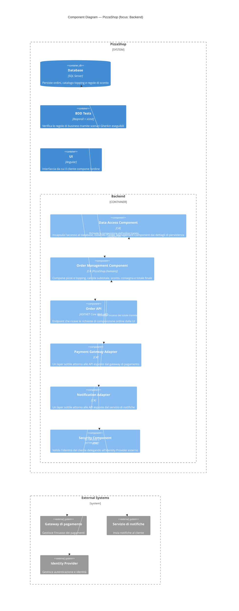

# Livello 3 — Component Diagram

> **Caso d'uso**: composizione di un ordine e calcolo del totale (vedi [README](README.md#il-caso-duso-scelto-per-la-demo)).

Si "apre" il sistema **PizzaShop** un livello più a fondo rispetto al [Container Diagram](02-container-diagram.md):
**UI**, **BDD Tests** e **Database** restano containers non ulteriormente scomposti (esattamente come, nell'esempio
ufficiale del C4 Model, la SPA e il Database restano containers mentre solo il Backend viene aperto), mentre il
container **Backend** viene "aperto" nei suoi componenti.

A differenza di una prima bozza di questo documento, i componenti **non** ricalcano le singole classi C# — quel
livello di dettaglio appartiene al [Livello 4 — Code](04-code-level-note.md), che mostra già il class diagram di
`Order`, `Pizza`, `ToppingCatalog` e `DiscountPolicy`. Qui, coerentemente con la definizione di "componente" del C4
Model (un raggruppamento di funzionalità correlate dietro un'interfaccia, tipicamente corrispondente a un
namespace o assembly), il Backend viene scomposto in **5 componenti**:

- **Order API**: il punto di ingresso HTTP.
- **Security Component**: valida l'identità del cliente delegando all'Identity Provider esterno (non avendo una
  logica di sicurezza propria oltre alla delega, non ha senso separarlo in "Security Component" + "Identity
  Provider Adapter": è un unico componente che incapsula quella responsabilità).
- **Order Management Component**: tutta la logica di business già implementata (composizione pizze, topping,
  sconti, consegna) — corrisponde 1:1 alla libreria `PizzaShop.Domain`.
- **Data Access Component**: isola la logica di business dai dettagli di persistenza (query, connessioni al
  database). È il motivo per cui il [class diagram](04-code-level-note.md) di `PizzaShop.Domain` non contiene
  codice di accesso ai dati: quella responsabilità non appartiene all'Order Management Component, ma a un
  componente distinto (ancora da realizzare).
- **Payment/Notification Adapter**: due adapter distinti verso i rispettivi sistemi esterni (pattern usato anche
  nell'esempio ufficiale per isolare la logica di business dai dettagli di integrazione).

## Note di lettura
- `System_Boundary(...)`: il confine del sistema `PizzaShop` nel suo complesso — lo stesso usato nel
  [Container Diagram](02-container-diagram.md) — che qui contiene sia i container non scomposti (**UI**, **BDD
  Tests**, **Database**) sia il container **Backend**, ulteriormente aperto nei suoi componenti. Questo rispecchia
  la struttura dell'esempio ufficiale (Internet Banking System), dove la SPA e il Database restano a livello
  container mentre solo l'API Application viene scomposta.
- `Container(...)` / `ContainerDb(...)`: usati qui per **UI**, **BDD Tests** e **Database** perché a questo livello
  di zoom non ci interessa mostrarne i componenti interni — sono "di contesto", stessa tecnica dell'esempio
  ufficiale per SPA e Database.
- `Container_Boundary(...)`: il confine del container che stiamo "aprendo" (qui il Backend).
- `Component(...)`: un raggruppamento di funzionalità correlate dietro un'interfaccia — **non** corrisponde a una
  singola classe. Solo **Order Management Component** è già implementato (nella libreria `PizzaShop.Domain`); gli
  altri quattro fanno parte del design ma sono ancora da realizzare (vedi tabella in fondo).
- **Perché Security Component e Identity Provider Adapter sono stati unificati**: in una versione precedente di
  questo documento erano due componenti distinti, ma la responsabilità dell'adapter (parlare con l'Identity
  Provider via OAuth2/OIDC) *è* l'unica logica di sicurezza che il Backend possiede in questo caso d'uso — non
  c'è una logica di validazione locale da separare da un layer di comunicazione. Un solo componente **Security
  Component** rappresenta quindi meglio la responsabilità reale senza introdurre una distinzione artificiale.
- Il pattern **Adapter** (`Payment Gateway Adapter`, `Notification Adapter`) isola la logica di business dai
  dettagli delle singole integrazioni esterne, esattamente come nell'esempio ufficiale del C4 Model.
- **Data Access Component**: stesso principio di isolamento applicato alla persistenza. L'Order Management
  Component non parla direttamente con il `Database`, ma passa dal Data Access Component — questo è anche il
  motivo per cui il [class diagram](04-code-level-note.md) (Livello 4) non mostra alcuna classe di accesso ai
  dati: quel codice non fa parte del componente analizzato in quel livello di zoom, ma di un componente distinto.
- `UpdateRelStyle(...)`: forza il colore di testo e linea delle relazioni in bianco, per restare leggibili anche
  su renderer con sfondo scuro (es. tema di default di mermaid.live), e sposta le etichette con
  `$offsetX`/`$offsetY` per evitare sovrapposizioni con i box esterni.

## Corrispondenza con il codice
| Componente nel diagramma | Stato nella solution attuale |
|---|---|
| Order Management Component | Implementato: libreria `PizzaShop.Domain` (`Order.cs`, `Pizza.cs`, `ToppingCatalog.cs`, `DiscountPolicy.cs`) |
| Order API | Non ancora implementato |
| Security Component | Non ancora implementato |
| Payment Gateway Adapter | Non ancora implementato |
| Notification Adapter | Non ancora implementato |
| Data Access Component | Non ancora implementato |

Le classi reali che compongono l'**Order Management Component** (`Order`, `Pizza`, `ToppingCatalog`,
`DiscountPolicy`, con i relativi campi e metodi) sono mostrate nel dettaglio nel
[Livello 4 — Code](04-code-level-note.md), il livello di zoom corretto per scendere fino alle singole classi.
Le stesse regole di business sono quelle verificate dagli scenari Gherkin descritti in
[docs/gherkin-cucumber](../gherkin-cucumber/README.md).
