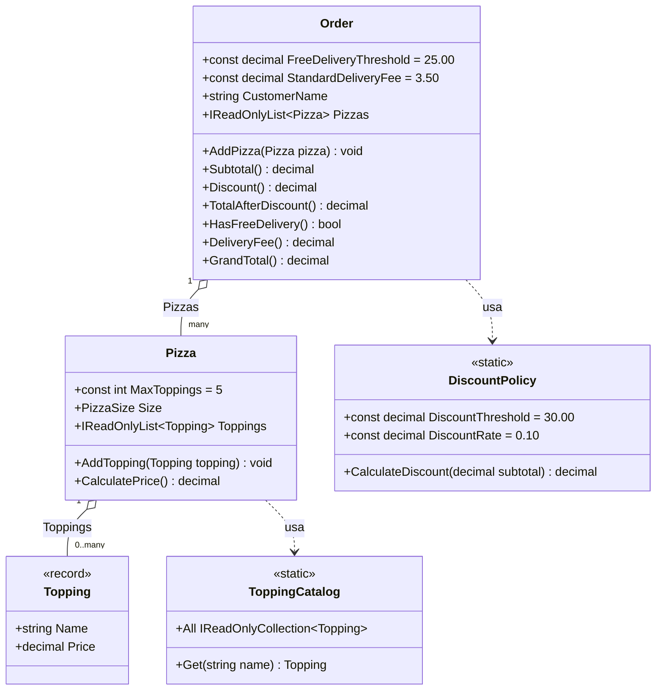

# Livello 4 — Code (nota)

Il livello **Code** è il più dettagliato del C4 Model: tipicamente un class diagram UML con classi, attributi e
metodi. Nella pratica **è il livello meno usato**, per un motivo semplice: cambia ad ogni refactoring, quindi
mantenerlo a mano manualmente è costoso e il diagramma "invecchia" (diventa disallineato dal codice reale) molto
in fretta. La raccomandazione comune (anche di Simon Brown, l'autore del C4 Model) è **generarlo al bisogno**
direttamente dall'IDE o da strumenti di analisi statica, piuttosto che tenerlo come documento "vivo" nel repository.

A puro titolo illustrativo, ecco come apparirebbe per le classi principali del componente `PizzaShop.Domain`
(scritto anch'esso come diagramma-as-code, stavolta con la sintassi `classDiagram` di Mermaid, pensata proprio
per le classi):

## Da tenere a mente
Questo file è pensato come **esempio didattico**, non come documentazione da tenere sincronizzata manualmente ad
ogni modifica del codice. Se in futuro serve un class diagram aggiornato, la via consigliata è generarlo
automaticamente (es. dagli strumenti di class diagram integrati nell'IDE) invece di aggiornare a mano
questo file.
