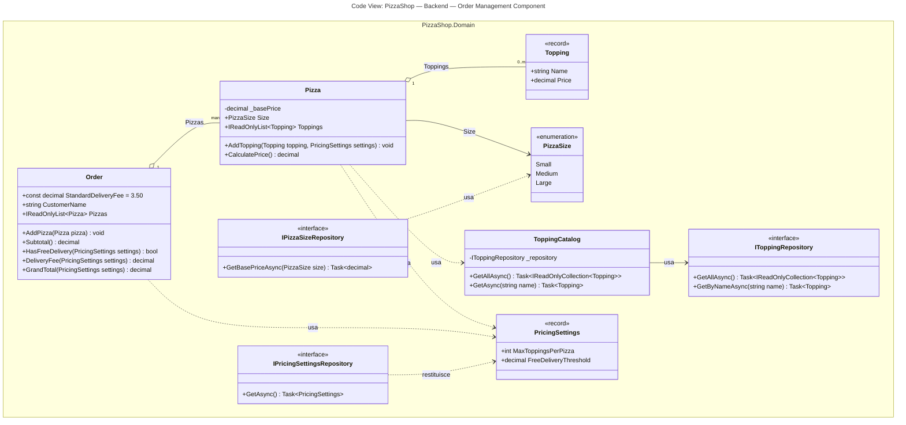

# Livello 4 — Code (nota)

Il livello **Code** è il più dettagliato del C4 Model: tipicamente un class diagram UML con classi, attributi e
metodi. Nella pratica **è il livello meno usato**, per un motivo semplice: cambia ad ogni refactoring, quindi
mantenerlo a mano manualmente è costoso e il diagramma "invecchia" (diventa disallineato dal codice reale) molto
in fretta. La raccomandazione comune (anche di Simon Brown, l'autore del C4 Model) è **generarlo al bisogno**
direttamente dall'IDE o da strumenti di analisi statica, piuttosto che tenerlo come documento "vivo" nel repository.

A puro titolo illustrativo, ecco come apparirebbe per le classi principali dell'**Order Management Component**
(vedi [Component Diagram](03-component-diagram.md)), il cui nome tecnico nel codice è il namespace/libreria
`PizzaShop.Domain` — è per questo che il riquadro nel diagramma è etichettato `PizzaShop.Domain`: rappresenta
lo stesso componente, solo visto "dal lato codice" invece che "dal lato architettura". Il diagramma è scritto
anch'esso come diagramma-as-code, stavolta con la sintassi `classDiagram` di Mermaid, pensata proprio per le
classi.

> **Nota**: rispetto al codice demo attuale questo diagramma introduce alcune semplificazioni/modifiche
> intenzionali: `ToppingCatalog` è disegnato nella sua forma "realistica" (topping letti da un database
> tramite `IToppingRepository`), il prezzo base per formato è anch'esso letto da un database (tramite
> `IPizzaSizeRepository`, invece della costante `PizzaSizeExtensions.BasePrice()`), e la logica di sconto
> (`DiscountPolicy`) è stata rimossa del tutto — vedi i riquadri di approfondimento subito dopo il diagramma
> per il perché.

> Il titolo `Code View: PizzaShop — Backend — Order Management Component` è ora parte del diagramma stesso
> (definito nel frontmatter `title:` del blocco Mermaid), non solo di questo testo: resta quindi visibile
> anche se il diagramma viene esportato o incollato altrove come immagine isolata (vedi
> [Component Diagram](03-component-diagram.md) per il contesto architetturale completo).

> **Perché `ToppingCatalog` non è più `<<static>>`**: nel codice demo attuale i topping sono un dizionario
> hardcoded in memoria, ma questo diagramma vuole rappresentare un caso **realistico**, in cui topping e
> relativi prezzi vengono letti da un database (coerentemente col **Data Access Component** già previsto nel
> [Component Diagram](03-component-diagram.md)). Una classe che dipende da un database non può essere
> `static`: ha bisogno di una dipendenza iniettata (`IToppingRepository`) e i suoi metodi diventano
> asincroni (`Task<...>`), perché leggere da un DB è un'operazione di I/O. L'implementazione concreta di
> `IToppingRepository` (query SQL, ORM, ecc.) non compare qui: appartiene al Data Access Component, un
> componente distinto, esattamente come nell'esempio ufficiale del C4 Model `CoreBankingSystemConnection`
> incapsula i dettagli di rete senza esporli al chiamante.

> **Perché `Pizza` e `Order` restano "pure" invece di dipendere da un repository**: sia il numero massimo di
> topping sia la soglia di consegna gratuita sono pensati come configurabili dal proprietario della pizzeria
> (quindi letti da un database), ma qui la scelta di design è diversa da `ToppingCatalog`. `Pizza` e `Order`
> sono **entità di dominio**: farle dipendere direttamente da un repository le renderebbe difficili da
> istanziare/testare e mescolerebbe "cosa sono" con "da dove arrivano i dati". Per questo ricevono le
> impostazioni come **parametro** (`PricingSettings settings`), senza sapere nulla di come vengono caricate.
> Chi orchestra la composizione dell'ordine (tipicamente l'Order API o un livello applicativo non mostrato in
> questo diagramma, perché fuori scope dell'Order Management Component) è responsabile di caricare
> `PricingSettings` una volta, tramite `IPricingSettingsRepository`, e di passarla a valle.

> **Perché anche il prezzo base per formato è DB-driven**: nel codice demo attuale
> `PizzaSizeExtensions.BasePrice()` è un metodo statico con uno `switch` su valori hardcoded (Small = 5.00,
> Medium = 7.50, Large = 10.00). Qui il diagramma lo tratta come un altro dato di menu modificabile dal
> proprietario della pizzeria, esattamente come i topping: `IPizzaSizeRepository` incapsula la lettura del
> prezzo base per un dato `PizzaSize` da un database. Per restare coerente con la scelta fatta per `Pizza`
> (un'entità pura, senza dipendenze da repository), il prezzo base **non viene risolto al momento del calcolo**
> ma al momento della **creazione della pizza**: chi orchestra l'ordine chiama prima
> `IPizzaSizeRepository.GetBasePriceAsync(size)`, poi crea la pizza passando il valore già risolto (es.
> `new Pizza(size, basePrice)`), che lo salva nel campo privato `_basePrice`. Così `CalculatePrice()` resta
> senza parametri (base + topping), esattamente come `Order.Subtotal()`/`GrandTotal(settings)` non hanno
> bisogno di conoscere il prezzo base di ciascuna pizza: lo delegano a `Pizza.CalculatePrice()`, che lo ha già
> disponibile internamente. Non compare quindi alcuna relazione diretta tra `Pizza` e `IPizzaSizeRepository`
> nel diagramma, solo tra `IPizzaSizeRepository` e `PizzaSize` (la chiave usata per la ricerca).

> **Perché non c'è più `DiscountPolicy`**: per semplificare il modello, la logica di sconto è stata rimossa del
> tutto. Il costo di consegna standard (`StandardDeliveryFee`) resta invece una costante fissa in `Order`,
> perché non è pensato come un valore che il proprietario debba modificare spesso a runtime.

## Da tenere a mente
Questo file è pensato come **esempio didattico**, non come documentazione da tenere sincronizzata manualmente ad
ogni modifica del codice. Se in futuro serve un class diagram aggiornato, la via consigliata è generarlo
automaticamente (es. dagli strumenti di class diagram integrati nell'IDE) invece di aggiornare a mano
questo file.

In questo caso specifico, `ToppingCatalog`/`IToppingRepository`, `PricingSettings`/`IPricingSettingsRepository`
e `IPizzaSizeRepository` sono un esempio di **scelta di design intenzionale**, non di codice generato: il
diagramma mostra deliberatamente una versione più realistica di quella attualmente implementata nel progetto
demo, per illustrare come cambierebbero le classi una volta introdotta la persistenza reale (`PizzaShop.Domain`
oggi non contiene ancora `IToppingRepository`, `IPricingSettingsRepository` né `IPizzaSizeRepository` nel
codice, `MaxToppings`/`FreeDeliveryThreshold` sono ancora costanti hardcoded in `Pizza`/`Order`, il prezzo base
per formato è ancora calcolato da `PizzaSizeExtensions.BasePrice()`, e il codice demo attuale include ancora
`DiscountPolicy`, che qui è stata volutamente rimossa per semplificare il modello).
