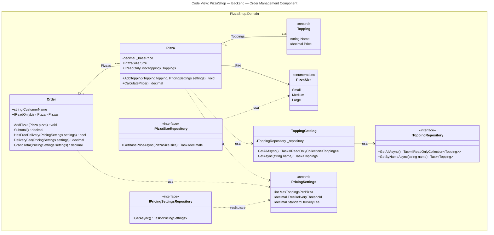

# Livello 4 — Code (nota)

Il livello **Code** è il più dettagliato del C4 Model: tipicamente un class diagram UML con classi, attributi e
metodi. Nella pratica **è il livello meno usato**, per un motivo semplice: cambia ad ogni refactoring, quindi
mantenerlo a mano manualmente è costoso e il diagramma "invecchia" (diventa disallineato dal codice reale) molto
in fretta. La raccomandazione comune (anche di Simon Brown, l'autore del C4 Model) è **generarlo al bisogno**
direttamente dall'IDE o da strumenti di analisi statica, piuttosto che tenerlo come documento "vivo" nel repository.

A puro titolo illustrativo, ecco come apparirebbe per le classi principali dell'**Order Management Component**
(vedi [Component Diagram](03-component-diagram.md)), il cui nome tecnico nel codice è il namespace/libreria
`PizzaShop.Domain` — è per questo che il riquadro nel diagramma è etichettato `PizzaShop.Domain`: rappresenta
lo stesso componente, solo visto "dal lato codice" invece che "dal lato architettura". Il diagramma è scritto
anch'esso come diagramma-as-code, stavolta con la sintassi `classDiagram` di Mermaid, pensata proprio per le
classi.

> **Nota**: questo diagramma rispecchia il codice effettivamente presente in `PizzaShop.Domain`: `ToppingCatalog`
> legge i topping tramite `IToppingRepository`, il prezzo base per formato viene letto tramite
> `IPizzaSizeRepository`, e la scontistica è stata rimossa del tutto. Le implementazioni concrete di queste
> interfacce oggi sono hardcoded (progetto `PizzaShop.Infrastructure.InMemory`, che simula un database senza
> averne uno vero), ma il dominio dipende solo dalle interfacce: sostituirle in futuro con implementazioni
> basate su un database reale non richiederebbe modifiche a `Pizza`, `Order` o `ToppingCatalog` — vedi i
> riquadri di approfondimento subito dopo il diagramma per il perché.

```mermaid
---
title: "Code View: PizzaShop — Backend — Order Management Component"
---
classDiagram
	namespace PizzaShopDomain["PizzaShop.Domain"] {
		class Pizza {
			-decimal _basePrice
			+PizzaSize Size
			+IReadOnlyList~Topping~ Toppings
			+AddTopping(Topping topping, PricingSettings settings) void
			+CalculatePrice() decimal
		}

		class Order {
			+string CustomerName
			+IReadOnlyList~Pizza~ Pizzas
			+AddPizza(Pizza pizza) void
			+Subtotal() decimal
			+HasFreeDelivery(PricingSettings settings) bool
			+DeliveryFee(PricingSettings settings) decimal
			+GrandTotal(PricingSettings settings) decimal
		}

		class PizzaSize {
			<<enumeration>>
			Small
			Medium
			Large
		}

		class IPizzaSizeRepository {
			<<interface>>
			+GetBasePriceAsync(PizzaSize size) Task~decimal~
		}

		class Topping {
			<<record>>
			+string Name
			+decimal Price
		}

		class ToppingCatalog {
			-IToppingRepository _repository
			+GetAllAsync() Task~IReadOnlyCollection~Topping~~
			+GetAsync(string name) Task~Topping~
		}

		class IToppingRepository {
			<<interface>>
			+GetAllAsync() Task~IReadOnlyCollection~Topping~~
			+GetByNameAsync(string name) Task~Topping~
		}

		class PricingSettings {
			<<record>>
			+int MaxToppingsPerPizza
			+decimal FreeDeliveryThreshold
			+decimal StandardDeliveryFee
		}

		class IPricingSettingsRepository {
			<<interface>>
			+GetAsync() Task~PricingSettings~
		}
	}

	Order "1" o-- "many" Pizza : Pizzas
	Pizza "1" o-- "0..many" Topping : Toppings
	Pizza --> PizzaSize : Size
	Pizza ..> ToppingCatalog : usa
	ToppingCatalog --> IToppingRepository : usa
	Pizza ..> PricingSettings : usa
	Order ..> PricingSettings : usa
	IPricingSettingsRepository ..> PricingSettings : restituisce
	IPizzaSizeRepository ..> PizzaSize : usa
```

> Il titolo `Code View: PizzaShop — Backend — Order Management Component` è ora parte del diagramma stesso
> (definito nel frontmatter `title:` del blocco Mermaid), non solo di questo testo: resta quindi visibile
> anche se il diagramma viene esportato o incollato altrove come immagine isolata (vedi
> [Component Diagram](03-component-diagram.md) per il contesto architetturale completo).

> **Perché `ToppingCatalog` non è più `<<static>>`**: per rappresentare un caso **realistico**, in cui topping e
> relativi prezzi vengono letti da un database (coerentemente col **Data Access Component** già previsto nel
> [Component Diagram](03-component-diagram.md)), una classe che dipende da un database non può essere
> `static`: ha bisogno di una dipendenza iniettata (`IToppingRepository`) e i suoi metodi diventano
> asincroni (`Task<...>`), perché leggere da un DB è un'operazione di I/O. Oggi l'unica implementazione
> concreta di `IToppingRepository` è `InMemoryToppingRepository` (progetto `PizzaShop.Infrastructure.InMemory`),
> che restituisce valori hardcoded invece di interrogare un vero database: appartiene comunque, concettualmente,
> al Data Access Component, esattamente come nell'esempio ufficiale del C4 Model `CoreBankingSystemConnection`
> incapsula i dettagli di rete senza esporli al chiamante. Sostituirla domani con una implementazione basata
> su un vero database richiede solo di scrivere una nuova classe che implementa `IToppingRepository` e di
> registrarla al posto di quella in-memory nella composizione delle dipendenze (`Program.cs` per la console
> app, l'hook Reqnroll per i test): nessuna modifica a `ToppingCatalog`, `Pizza` o `Order`.

> **Perché `Pizza` e `Order` restano "pure" invece di dipendere da un repository**: sia il numero massimo di
> topping sia la soglia di consegna gratuita sono pensati come configurabili dal proprietario della pizzeria
> (quindi letti da un database), ma qui la scelta di design è diversa da `ToppingCatalog`. `Pizza` e `Order`
> sono **entità di dominio**: farle dipendere direttamente da un repository le renderebbe difficili da
> istanziare/testare e mescolerebbe "cosa sono" con "da dove arrivano i dati". Per questo ricevono le
> impostazioni come **parametro** (`PricingSettings settings`), senza sapere nulla di come vengono caricate.
> Chi orchestra la composizione dell'ordine (tipicamente l'Order API o un livello applicativo non mostrato in
> questo diagramma, perché fuori scope dell'Order Management Component) è responsabile di caricare
> `PricingSettings` una volta, tramite `IPricingSettingsRepository`, e di passarla a valle.

> **Perché anche il prezzo base per formato è DB-driven**: è trattato come un altro dato di menu modificabile
> dal proprietario della pizzeria, esattamente come i topping: `IPizzaSizeRepository` incapsula la lettura del
> prezzo base per un dato `PizzaSize` da un database (oggi, in pratica, da `InMemoryPizzaSizeRepository`, con
> valori hardcoded). Per restare coerente con la scelta fatta per `Pizza`
> (un'entità pura, senza dipendenze da repository), il prezzo base **non viene risolto al momento del calcolo**
> ma al momento della **creazione della pizza**: chi orchestra l'ordine chiama prima
> `IPizzaSizeRepository.GetBasePriceAsync(size)`, poi crea la pizza passando il valore già risolto (es.
> `new Pizza(size, basePrice)`), che lo salva nel campo privato `_basePrice`. Così `CalculatePrice()` resta
> senza parametri (base + topping), esattamente come `Order.Subtotal()`/`GrandTotal(settings)` non hanno
> bisogno di conoscere il prezzo base di ciascuna pizza: lo delegano a `Pizza.CalculatePrice()`, che lo ha già
> disponibile internamente. Non compare quindi alcuna relazione diretta tra `Pizza` e `IPizzaSizeRepository`
> nel diagramma, solo tra `IPizzaSizeRepository` e `PizzaSize` (la chiave usata per la ricerca).

> **Perché non c'è più `DiscountPolicy`**: per semplificare il modello, la logica di sconto è stata rimossa del
> tutto. Il costo di consegna standard (`StandardDeliveryFee`) invece è stato spostato dentro `PricingSettings`,
> accanto a `MaxToppingsPerPizza` e `FreeDeliveryThreshold`: è un altro valore che il proprietario della pizzeria
> potrebbe voler modificare (es. per una promozione), quindi segue la stessa logica DB-driven letta tramite
> `IPricingSettingsRepository.GetAsync()`, invece di restare una costante fissa in `Order`.

## Da tenere a mente
Questo file è pensato come **esempio didattico**, non come documentazione da tenere sincronizzata manualmente ad
ogni modifica del codice. Se in futuro serve un class diagram aggiornato, la via consigliata è generarlo
automaticamente (es. dagli strumenti di class diagram integrati nell'IDE) invece di aggiornare a mano
questo file.

In questo caso specifico, `ToppingCatalog`/`IToppingRepository`, `PricingSettings`/`IPricingSettingsRepository`
e `IPizzaSizeRepository` sono ora effettivamente implementati in `PizzaShop.Domain`, con implementazioni
concrete hardcoded in memoria nel progetto `PizzaShop.Infrastructure.InMemory`
(`InMemoryToppingRepository`, `InMemoryPizzaSizeRepository`, `InMemoryPricingSettingsRepository`): questo
separato progetto gioca lo stesso ruolo che avrebbe un progetto di data access basato su un vero database
(es. Entity Framework Core), permettendo di sostituirlo in futuro senza toccare `PizzaShop.Domain` né i
consumer (`Program.cs`, i test BDD). `DiscountPolicy` è stata rimossa dal codice per semplificare il modello,
coerentemente con questo diagramma.
