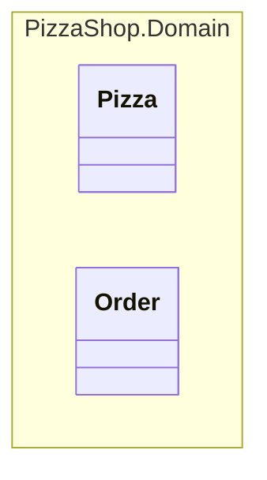
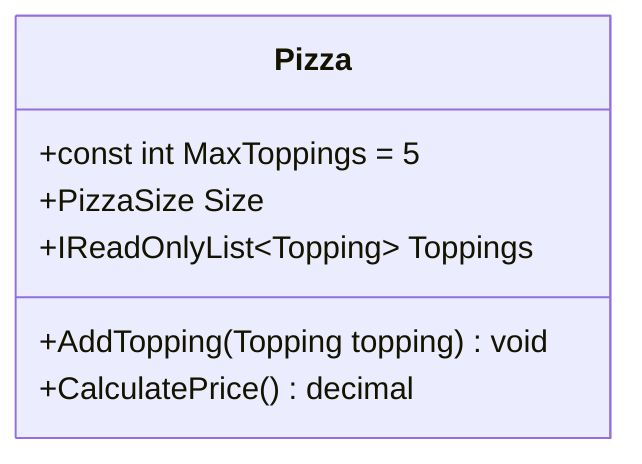
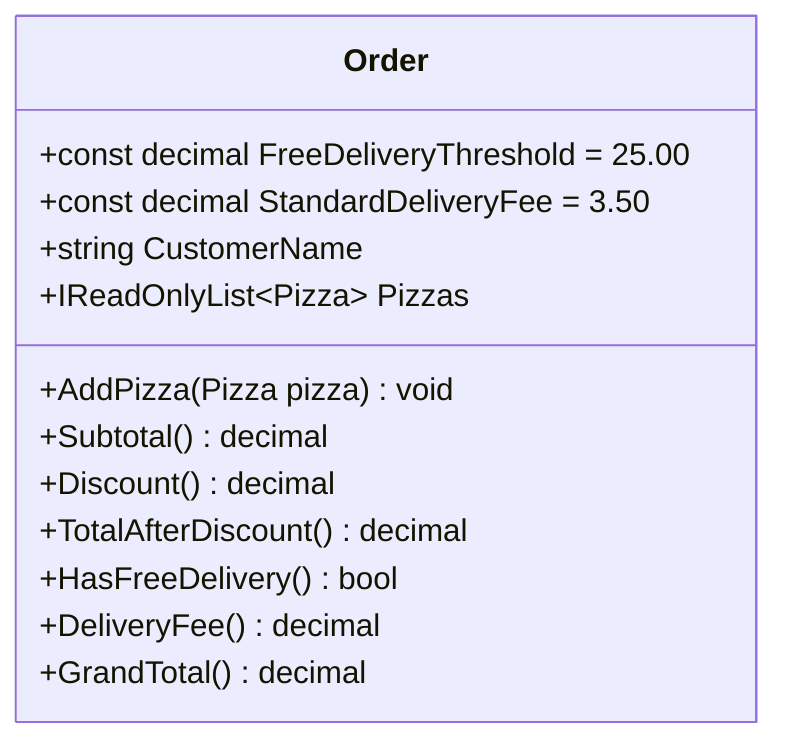
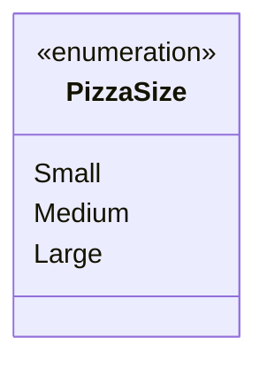
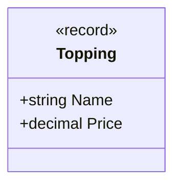
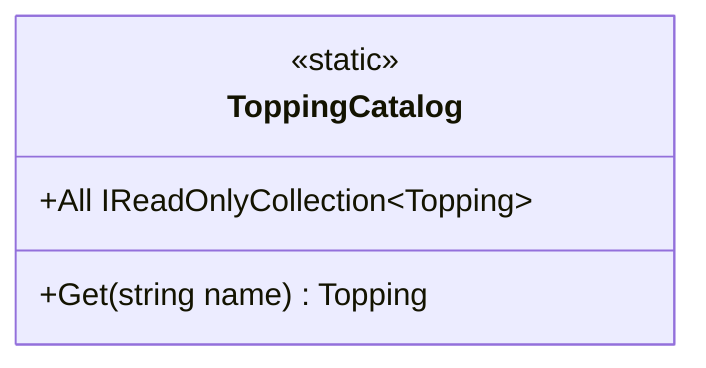
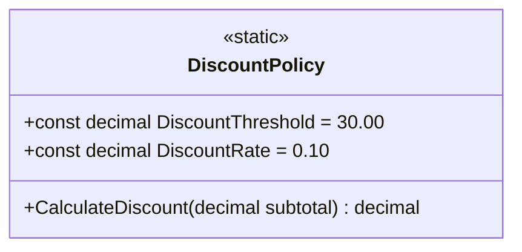
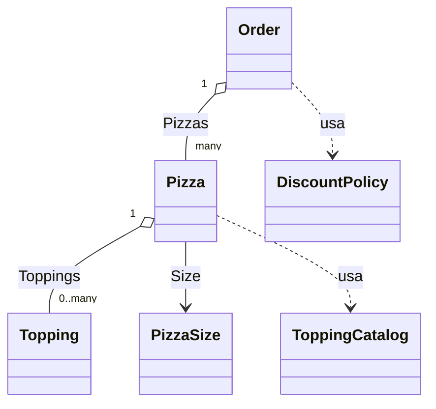
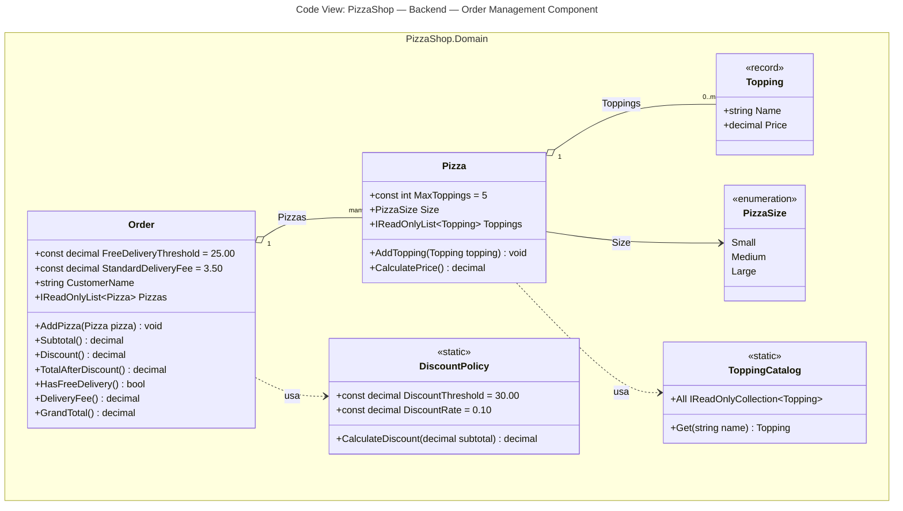

# Guida di lettura — Class Diagram (Livello 4)

> Questo documento spiega **per filo e per segno** il class diagram in [04-code-level-note.md](04-code-level-note.md),
> simbolo per simbolo. È pensato per chi ha dimestichezza limitata con la notazione UML.

## Indice
- [1. Cos'è un class diagram](#1-cosè-un-class-diagram)
- [2. Il box del componente (namespace)](#2-il-box-del-componente-namespace)
- [3. Anatomia di una classe nel diagramma](#3-anatomia-di-una-classe-nel-diagramma)
- [4. Classe per classe](#4-classe-per-classe)
- [5. Le relazioni tra le classi](#5-le-relazioni-tra-le-classi)
- [6. Diagramma completo commentato](#6-diagramma-completo-commentato)

> Le sezioni 4 e 5 mostrano gli snippet delle singole classi/relazioni senza il riquadro `namespace` per
> restare più leggibili in isolamento; il riquadro compare per intero solo nel diagramma reale ([04-code-level-note.md](04-code-level-note.md)) e nel riepilogo finale della sezione 6.

---

## 1. Cos'è un class diagram

Un class diagram UML rappresenta la **struttura statica** del codice: quali classi esistono, quali dati
contengono (attributi), quali operazioni espongono (metodi) e come sono collegate tra loro (relazioni).

Importante: un class diagram **non mostra comportamento** (non mostra *quando* o *in che ordine* i metodi
vengono chiamati — quello è compito del [sequence diagram](05-sequence-diagram.md)). Mostra solo *cosa esiste*
e *come è collegato*.

Nel nostro caso il diagramma descrive le classi del progetto [`PizzaShop.Domain`](../../PizzaShop.Domain/),
cioè l'**Order Management Component** del [Component Diagram](03-component-diagram.md).

---

## 2. Il box del componente (namespace)

Nell'esempio ufficiale del C4 Model (il "Core Banking System Adapter" di Simon Brown), tutte le classi sono
disegnate dentro un unico grande riquadro etichettato con il nome del package Java
(`com.bigbank.ib.component.corebankingsystem`) — a indicare visivamente che quel class diagram descrive **un
singolo componente**, non l'intero sistema. In fondo alla pagina compare anche una didascalia
("Code View: Internet Banking System - Backend - Core Banking System Adapter") che rende esplicito lo stesso
concetto in forma testuale.

Il nostro diagramma fa la stessa cosa, usando il costrutto `namespace` della sintassi `classDiagram` di
Mermaid:



`namespace NomeNamespace { ... }` disegna un riquadro tratteggiato che racchiude tutte le classi al suo
interno ed è etichettato col nome indicato — esattamente il tipo di box "contenitore" dell'esempio ufficiale.

> **Attenzione alla dot notation**: la prima versione di questo diagramma usava direttamente
> `namespace PizzaShop.Domain { ... }`. Nella sintassi Mermaid, però, il punto in un nome di namespace viene
> interpretato come **separatore gerarchico** (crea automaticamente namespace annidati, come una dot notation
> "Company.Engineering.Backend"): il risultato era **due riquadri annidati**, uno esterno `PizzaShop` e uno
> interno `Domain`, che dava l'impressione errata che `PizzaShop` (l'intero sistema) fosse il nome del
> componente. Per ottenere un **unico riquadro** con il nome tecnico completo si usa invece la sintassi con
> etichetta esplicita `namespace Id["Label"]`: l'`Id` (`PizzaShopDomain`, senza punti) è solo l'identificatore
> interno usato da Mermaid, mentre la `"Label"` (`PizzaShop.Domain`) è il testo effettivamente mostrato nel
> riquadro — e può contenere il punto senza essere interpretata come annidamento.

Il nome mostrato è `PizzaShop.Domain`, che non è scelto a caso: è **il namespace C# reale** in cui
sono dichiarate tutte queste classi (vedi l'intestazione `namespace PizzaShop.Domain;` in cima a ogni file, es.
[`Pizza.cs`](../../PizzaShop.Domain/Pizza.cs)), ed è anche il nome tecnico già associato all'**Order Management
Component** nella tabella di corrispondenza del [Component Diagram](03-component-diagram.md#corrispondenza-con-il-codice).

Il diagramma reale in [04-code-level-note.md](04-code-level-note.md) porta la stessa didascalia in stile
"Code View" dell'esempio ufficiale, ma con un accorgimento in più: non è solo testo Markdown scritto *sotto*
il blocco Mermaid (che sparirebbe se il diagramma venisse esportato o incollato altrove come immagine
isolata), bensì è definita nel **frontmatter** del diagramma stesso (`title: "..."` prima di `classDiagram`),
quindi Mermaid la disegna *dentro* l'immagine renderizzata, sopra il riquadro delle classi — esattamente come
la didascalia dell'esempio ufficiale è parte integrante della sua immagine.

---

## 3. Anatomia di una classe nel diagramma

Ogni classe è disegnata così:



Il rettangolo `class NomeClasse { ... }` contiene, riga per riga, i **membri** della classe. Ogni riga si legge
con queste regole:

| Simbolo/sintassi | Significato | Equivalente C# |
|---|---|---|
| `+` a inizio riga | Visibilità **pubblica** (`public`) | `public` |
| `-` a inizio riga (non presente qui) | Visibilità **privata** (`private`) | `private` |
| `#` a inizio riga (non presente qui) | Visibilità **protetta** (`protected`) | `protected` |
| `const int MaxToppings = 5` | Campo costante con valore | `public const int MaxToppings = 5;` |
| `PizzaSize Size` | Attributo/proprietà: `Tipo NomeProprietà` | `public PizzaSize Size { get; }` |
| `IReadOnlyList~Topping~` | Generico: la tilde `~...~` sostituisce `<...>` (Mermaid non può usare `<>` perché sono riservati per altre notazioni UML) | `IReadOnlyList<Topping>` |
| `AddTopping(Topping topping) void` | Metodo: `NomeMetodo(TipoParam nomeParam) TipoRitorno` | `public void AddTopping(Topping topping)` |
| `CalculatePrice() decimal` | Metodo senza parametri che ritorna un valore | `public decimal CalculatePrice()` |

Nessuna riga inizia con `-` o `#` in questo diagramma perché **tutti i membri disegnati sono pubblici**: i
campi privati di implementazione (es. `_toppings`, `_pizzas` nel codice reale) sono stati **volutamente omessi**
perché un class diagram di norma mostra solo la parte rilevante all'esterno (l'API pubblica), non i dettagli
di implementazione interna.

### Gli stereotipi `<<...>>`

Alcune classi hanno una riga tra doppie parentesi angolari, es. `<<record>>` o `<<static>>`. Sono **stereotipi
UML**: etichette che aggiungono un'informazione extra sul "tipo" della classe, che UML puro non prevede ma che
è utile specificare quando si documenta codice C#:

- `<<record>>` → la classe è in realtà un `record` C# (tipo immutabile con uguaglianza per valore).
- `<<static>>` → la classe è `static` (non istanziabile, contiene solo membri statici).
- `<<enumeration>>` → la classe è in realtà un `enum` C#.

---

## 4. Classe per classe

### 4.1 `Pizza`


Corrisponde a [`Pizza.cs`](../../PizzaShop.Domain/Pizza.cs). Rappresenta una singola pizza:

- `MaxToppings = 5`: regola di business, il numero massimo di ingredienti extra aggiungibili.
- `Size`: il formato della pizza (vedi [`PizzaSize`](#33-pizzasize)).
- `Toppings`: la lista (di sola lettura dall'esterno) degli ingredienti extra aggiunti finora.
- `AddTopping(...)`: aggiunge un ingrediente extra (lancia un'eccezione se si supera `MaxToppings`, ma questo
  dettaglio *comportamentale* non compare qui — è nel codice e nel sequence diagram).
- `CalculatePrice()`: calcola il prezzo totale della pizza (base + ingredienti).

### 4.2 `Order`



Corrisponde a [`Order.cs`](../../PizzaShop.Domain/Order.cs). Rappresenta l'ordine del cliente, con una o più
pizze:

- `FreeDeliveryThreshold = 25.00`: soglia oltre la quale la consegna è gratuita.
- `StandardDeliveryFee = 3.50`: costo di consegna standard, se sotto soglia.
- `CustomerName`: nome del cliente che ha fatto l'ordine.
- `Pizzas`: la lista delle pizze incluse nell'ordine.
- `AddPizza(...)`: aggiunge una pizza all'ordine.
- `Subtotal()`: somma dei prezzi di tutte le pizze, prima dello sconto.
- `Discount()`: importo dello sconto applicato (delega a [`DiscountPolicy`](#35-discountpolicy)).
- `TotalAfterDiscount()`: subtotale meno sconto.
- `HasFreeDelivery()`: `true` se il totale scontato supera `FreeDeliveryThreshold`.
- `DeliveryFee()`: `0` se `HasFreeDelivery()`, altrimenti `StandardDeliveryFee`.
- `GrandTotal()`: totale finale (`TotalAfterDiscount() + DeliveryFee()`).

### 4.3 `PizzaSize`



Corrisponde all'enum in [`PizzaSize.cs`](../../PizzaShop.Domain/PizzaSize.cs). È un semplice elenco di valori
possibili (`Small`, `Medium`, `Large`) — non ha visibilità `+` perché i valori di un `enum` sono per natura
pubblici e non sono né campi né metodi in senso classico.

> **Nota**: nel codice reale esiste anche `PizzaSizeExtensions.BasePrice()`, un *extension method* che calcola
> il prezzo base per formato. Non è stato disegnato come classe a sé per non appesantire il diagramma con un
> dettaglio di implementazione (l'extension method non è un concetto di dominio, ma un modo C#-specifico di
> "aggiungere" un metodo a un enum dall'esterno).

### 4.4 `Topping`



Corrisponde a [`Topping.cs`](../../PizzaShop.Domain/Topping.cs): un ingrediente extra, con nome e prezzo. È uno
stereotipo `<<record>>` perché nel codice è dichiarato come `public sealed record Topping(string Name, decimal Price)`
— un record C#, tipicamente immutabile e con uguaglianza per valore (due `Topping` con stesso nome e prezzo sono
considerati uguali).

### 4.5 `ToppingCatalog`



Corrisponde a [`ToppingCatalog.cs`](../../PizzaShop.Domain/ToppingCatalog.cs): il catalogo di ingredienti
disponibili. È `<<static>>` perché nel codice è `public static class ToppingCatalog` — non si crea mai
un'istanza, si chiamano i suoi membri direttamente sul nome della classe (es. `ToppingCatalog.Get("Funghi")`).

- `All`: tutti gli ingredienti disponibili.
- `Get(string name)`: cerca un ingrediente per nome (lancia eccezione se non esiste).

### 4.6 `DiscountPolicy`



Corrisponde a [`DiscountPolicy.cs`](../../PizzaShop.Domain/DiscountPolicy.cs): la regola di sconto, anch'essa
`<<static>>` per lo stesso motivo di `ToppingCatalog`.

- `DiscountThreshold = 30.00`: soglia di subtotale oltre la quale scatta lo sconto.
- `DiscountRate = 0.10`: percentuale di sconto applicata (10%).
- `CalculateDiscount(decimal subtotal)`: calcola l'importo dello sconto dato un subtotale.

---

## 5. Le relazioni tra le classi

Dopo le classi, il diagramma dichiara come sono collegate tra loro:



Ci sono **tre tipi diversi** di relazione, ognuna con un significato UML preciso.

### 5.1 Aggregazione (`o--`) — "ha un/ha molti" con cardinalità

```
Order "1" o-- "many" Pizza : Pizzas
Pizza "1" o-- "0..many" Topping : Toppings
```

Il simbolo `o--` disegna una linea continua con un **cerchio vuoto** (○) dal lato della classe "contenitore"
(qui `Order` e `Pizza`). Significa: "questa classe contiene una collezione dell'altra classe come parte del suo
stato".

- `Order "1" o-- "many" Pizza`: **1** `Order` contiene **molte** `Pizza` (nell'attributo `Pizzas`).
- `Pizza "1" o-- "0..many" Topping`: **1** `Pizza` contiene **da 0 a molti** `Topping` (nell'attributo `Toppings`
  — una pizza può anche non avere ingredienti extra).

Le etichette `"1"`, `"many"`, `"0..many"` sono le **cardinalità/moltiplicità**: si leggono sempre dal lato della
classe più vicina all'etichetta. L'etichetta finale (`: Pizzas`, `: Toppings`) indica il **nome della proprietà**
nel codice che realizza quella relazione.

> **Perché aggregazione (○) e non composizione (●)?** In UML la composizione (cerchio pieno) indicherebbe che
> l'oggetto "contenuto" non ha senso di esistere senza il "contenitore" (se elimini l'`Order`, le sue `Pizza`
> smettono di esistere logicamente). Qui è stata scelta la semantica più leggera (aggregazione) perché a questo
> livello di dettaglio didattico non è un punto critico da forzare, anche se concettualmente si potrebbe
> discutere che sia più corretta la composizione.

### 5.2 Associazione diretta (`-->`) — riferimento a un tipo

```
Pizza --> PizzaSize : Size
```

La freccia continua **piena** (`-->`) indica che `Pizza` ha un riferimento diretto a `PizzaSize` tramite la
proprietà `Size`. È una relazione più "debole" dell'aggregazione: non è una collezione, è un singolo valore che
la classe usa come proprio attributo tipizzato.

### 5.3 Dipendenza (`..>`) — "usa, senza possedere"

```
Pizza ..> ToppingCatalog : usa
Order ..> DiscountPolicy : usa
```

La freccia **tratteggiata** (`..>`) indica una **dipendenza**: `Pizza` e `Order` *chiamano* metodi di
`ToppingCatalog` e `DiscountPolicy`, ma non li tengono come campo/proprietà — è un uso "di passaggio" (es.
`ToppingCatalog.Get(...)` viene chiamato quando serve, non è salvato da nessuna parte dentro `Pizza`).

Questo è coerente col fatto che `ToppingCatalog` e `DiscountPolicy` sono classi `<<static>>`: non si "possiede"
un'istanza di una classe statica, la si "usa" chiamandone i membri.

### 5.4 Riepilogo differenze linea/freccia

| Notazione Mermaid | Nome UML | Linea | Significato |
|---|---|---|---|
| `o--` | Aggregazione | Continua, cerchio vuoto | "Ha una collezione di" (contenitore/contenuto) |
| `-->` | Associazione | Continua, freccia piena | "Ha un riferimento a" (singolo valore tipizzato) |
| `..>` | Dipendenza | Tratteggiata, freccia aperta | "Usa temporaneamente", senza possedere |

---

## 6. Diagramma completo commentato



*Come già anticipato nella [sezione 2](#2-il-box-del-componente-namespace), il riquadro `PizzaShop.Domain` e il
titolo `Code View: PizzaShop — Backend — Order Management Component` rendono esplicito, direttamente
nell'immagine renderizzata, che questo è il code-view di un singolo componente — l'Order Management Component
— e non dell'intero sistema PizzaShop.*

**Lettura d'insieme, dall'alto verso il basso:**

1. Un `Order` **aggrega** più `Pizza` (relazione 1→molti).
2. Ogni `Pizza` **aggrega** da 0 a molti `Topping` (relazione 1→0..molti) e **ha un** `PizzaSize`.
3. `Pizza` **dipende da** `ToppingCatalog` per recuperare gli ingredienti disponibili (ma non lo possiede).
4. `Order` **dipende da** `DiscountPolicy` per calcolare lo sconto (ma non lo possiede).
5. `Topping` è un record immutabile, `ToppingCatalog` e `DiscountPolicy` sono classi statiche, `PizzaSize` è un
   enum — tre "nature" diverse di classe, segnalate dagli stereotipi.

Per vedere **quando** questi metodi vengono effettivamente chiamati, e in che ordine, consulta il
[sequence diagram](05-sequence-diagram.md), che descrive il flusso del caso d'uso "composizione di un ordine e
calcolo del totale" usando esattamente queste classi.
