# Guida di lettura — Class Diagram (Livello 4)

> Questo documento spiega **per filo e per segno** il class diagram in [04-code-level-note.md](04-code-level-note.md),
> simbolo per simbolo. È pensato per chi ha dimestichezza limitata con la notazione UML.

## Indice
- [1. Cos'è un class diagram](#1-cosè-un-class-diagram)
- [2. Il box del componente (namespace)](#2-il-box-del-componente-namespace)
- [3. Anatomia di una classe nel diagramma](#3-anatomia-di-una-classe-nel-diagramma)
- [4. Classe per classe](#4-classe-per-classe)
- [5. Le relazioni tra le classi](#5-le-relazioni-tra-le-classi)
- [6. Diagramma completo commentato](#6-diagramma-completo-commentato)

> Le sezioni 4 e 5 mostrano gli snippet delle singole classi/relazioni senza il riquadro `namespace` per
> restare più leggibili in isolamento; il riquadro compare per intero solo nel diagramma reale ([04-code-level-note.md](04-code-level-note.md)) e nel riepilogo finale della sezione 6.

---

## 1. Cos'è un class diagram

Un class diagram UML rappresenta la **struttura statica** del codice: quali classi esistono, quali dati
contengono (attributi), quali operazioni espongono (metodi) e come sono collegate tra loro (relazioni).

Importante: un class diagram **non mostra comportamento** (non mostra *quando* o *in che ordine* i metodi
vengono chiamati — quello è compito del [sequence diagram](05-sequence-diagram.md)). Mostra solo *cosa esiste*
e *come è collegato*.

Nel nostro caso il diagramma descrive le classi del progetto [`PizzaShop.Domain`](../../PizzaShop.Domain/),
cioè l'**Order Management Component** del [Component Diagram](03-component-diagram.md).

---

## 2. Il box del componente (namespace)

Nell'esempio ufficiale del C4 Model (il "Core Banking System Adapter" di Simon Brown), tutte le classi sono
disegnate dentro un unico grande riquadro etichettato con il nome del package Java
(`com.bigbank.ib.component.corebankingsystem`) — a indicare visivamente che quel class diagram descrive **un
singolo componente**, non l'intero sistema. In fondo alla pagina compare anche una didascalia
("Code View: Internet Banking System - Backend - Core Banking System Adapter") che rende esplicito lo stesso
concetto in forma testuale.

Il nostro diagramma fa la stessa cosa, usando il costrutto `namespace` della sintassi `classDiagram` di
Mermaid:

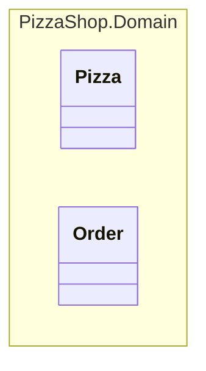

`namespace NomeNamespace { ... }` disegna un riquadro tratteggiato che racchiude tutte le classi al suo
interno ed è etichettato col nome indicato — esattamente il tipo di box "contenitore" dell'esempio ufficiale.

> **Attenzione alla dot notation**: la prima versione di questo diagramma usava direttamente
> `namespace PizzaShop.Domain { ... }`. Nella sintassi Mermaid, però, il punto in un nome di namespace viene
> interpretato come **separatore gerarchico** (crea automaticamente namespace annidati, come una dot notation
> "Company.Engineering.Backend"): il risultato era **due riquadri annidati**, uno esterno `PizzaShop` e uno
> interno `Domain`, che dava l'impressione errata che `PizzaShop` (l'intero sistema) fosse il nome del
> componente. Per ottenere un **unico riquadro** con il nome tecnico completo si usa invece la sintassi con
> etichetta esplicita `namespace Id["Label"]`: l'`Id` (`PizzaShopDomain`, senza punti) è solo l'identificatore
> interno usato da Mermaid, mentre la `"Label"` (`PizzaShop.Domain`) è il testo effettivamente mostrato nel
> riquadro — e può contenere il punto senza essere interpretata come annidamento.

Il nome mostrato è `PizzaShop.Domain`, che non è scelto a caso: è **il namespace C# reale** in cui
sono dichiarate tutte queste classi (vedi l'intestazione `namespace PizzaShop.Domain;` in cima a ogni file, es.
[`Pizza.cs`](../../PizzaShop.Domain/Pizza.cs)), ed è anche il nome tecnico già associato all'**Order Management
Component** nella tabella di corrispondenza del [Component Diagram](03-component-diagram.md#corrispondenza-con-il-codice).

Il diagramma reale in [04-code-level-note.md](04-code-level-note.md) porta la stessa didascalia in stile
"Code View" dell'esempio ufficiale, ma con un accorgimento in più: non è solo testo Markdown scritto *sotto*
il blocco Mermaid (che sparirebbe se il diagramma venisse esportato o incollato altrove come immagine
isolata), bensì è definita nel **frontmatter** del diagramma stesso (`title: "..."` prima di `classDiagram`),
quindi Mermaid la disegna *dentro* l'immagine renderizzata, sopra il riquadro delle classi — esattamente come
la didascalia dell'esempio ufficiale è parte integrante della sua immagine.

---

## 3. Anatomia di una classe nel diagramma

Ogni classe è disegnata così:

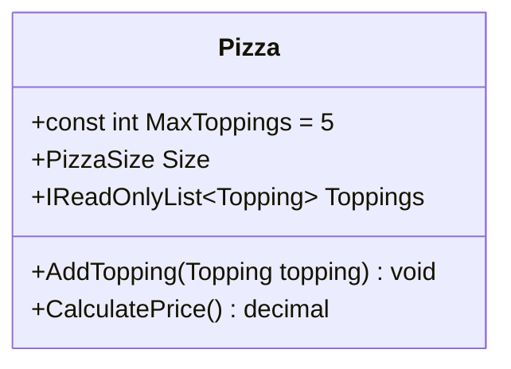

Il rettangolo `class NomeClasse { ... }` contiene, riga per riga, i **membri** della classe. Ogni riga si legge
con queste regole:

| Simbolo/sintassi | Significato | Equivalente C# |
|---|---|---|
| `+` a inizio riga | Visibilità **pubblica** (`public`) | `public` |
| `-` a inizio riga (non presente qui) | Visibilità **privata** (`private`) | `private` |
| `#` a inizio riga (non presente qui) | Visibilità **protetta** (`protected`) | `protected` |
| `const int MaxToppings = 5` | Campo costante con valore | `public const int MaxToppings = 5;` |
| `PizzaSize Size` | Attributo/proprietà: `Tipo NomeProprietà` | `public PizzaSize Size { get; }` |
| `IReadOnlyList~Topping~` | Generico: la tilde `~...~` sostituisce `<...>` (Mermaid non può usare `<>` perché sono riservati per altre notazioni UML) | `IReadOnlyList<Topping>` |
| `AddTopping(Topping topping) void` | Metodo: `NomeMetodo(TipoParam nomeParam) TipoRitorno` | `public void AddTopping(Topping topping)` |
| `CalculatePrice() decimal` | Metodo senza parametri che ritorna un valore | `public decimal CalculatePrice()` |

Nessuna riga inizia con `-` o `#` in questo diagramma perché **tutti i membri disegnati sono pubblici**: i
campi privati di implementazione (es. `_toppings`, `_pizzas` nel codice reale) sono stati **volutamente omessi**
perché un class diagram di norma mostra solo la parte rilevante all'esterno (l'API pubblica), non i dettagli
di implementazione interna.

### Gli stereotipi `<<...>>`

Alcune classi hanno una riga tra doppie parentesi angolari, es. `<<record>>` o `<<static>>`. Sono **stereotipi
UML**: etichette che aggiungono un'informazione extra sul "tipo" della classe, che UML puro non prevede ma che
è utile specificare quando si documenta codice C#:

- `<<record>>` → la classe è in realtà un `record` C# (tipo immutabile con uguaglianza per valore).
- `<<static>>` → la classe è `static` (non istanziabile, contiene solo membri statici).
- `<<enumeration>>` → la classe è in realtà un `enum` C#.

---

## 4. Classe per classe

### 4.1 `Pizza`

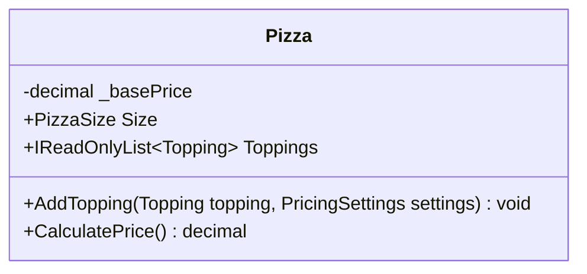

Corrisponde a [`Pizza.cs`](../../PizzaShop.Domain/Pizza.cs). Rappresenta una singola pizza:

- `_basePrice`: prezzo base per il formato scelto, ricevuto dal costruttore (vedi nota sotto) e conservato
  internamente — non è un parametro passato a ogni chiamata, ma uno stato della pizza fissato alla creazione.
- `Size`: il formato della pizza (vedi [`PizzaSize`](#43-pizzasize)).
- `Toppings`: la lista (di sola lettura dall'esterno) degli ingredienti extra aggiunti finora.
- `AddTopping(Topping topping, PricingSettings settings)`: aggiunge un ingrediente extra (lancia un'eccezione
  se si supera `settings.MaxToppingsPerPizza`, ma questo dettaglio *comportamentale* non compare qui — è nel
  codice e nel sequence diagram).
- `CalculatePrice()`: calcola il prezzo totale della pizza (`_basePrice` + ingredienti).

> **Nota**: nel codice demo attuale il limite di ingredienti extra è la costante `MaxToppings = 5` dichiarata
> dentro `Pizza` stessa. Qui il diagramma mostra una versione **realistica** in cui quel limite è configurabile
> dal proprietario della pizzeria (quindi letto da un database): non è più una costante interna a `Pizza`, ma
> arriva dall'esterno tramite il parametro `settings` (vedi [`PricingSettings`](#48-pricingsettings)).
> `Pizza` resta comunque un'entità "pura": non sa nulla di database o repository, riceve solo il valore già
> pronto — vedi la sezione 5.3 per il perché di questa scelta.
>
> Lo stesso vale per il prezzo base: nel codice demo attuale `CalculatePrice()` non prende parametri e calcola
> `Size.BasePrice() + _toppings.Sum(...)`, dove `BasePrice()` è un metodo di estensione con valori hardcoded.
> Qui invece il prezzo base viene risolto da chi crea l'ordine (tramite
> [`IPizzaSizeRepository`](#43bis-ipizzasizerepository)) e passato al **costruttore** di `Pizza`
> (`new Pizza(size, basePrice)`), che lo salva in `_basePrice`. Per questo `CalculatePrice()` non ha bisogno di
> alcun parametro: il valore è già disponibile internamente, esattamente come avviene per i `Topping` già
> aggiunti — `Pizza` continua a non sapere nulla di database o repository.

### 4.2 `Order`

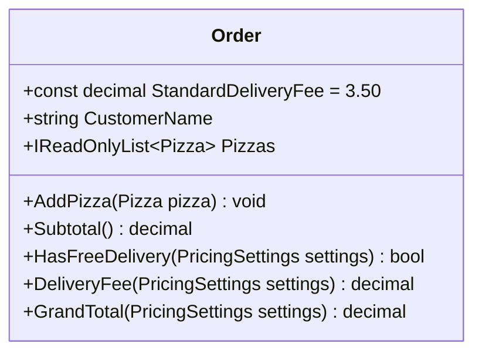

Corrisponde a [`Order.cs`](../../PizzaShop.Domain/Order.cs). Rappresenta l'ordine del cliente, con una o più
pizze:

- `StandardDeliveryFee = 3.50`: costo di consegna standard, se sotto soglia.
- `CustomerName`: nome del cliente che ha fatto l'ordine.
- `Pizzas`: la lista delle pizze incluse nell'ordine.
- `AddPizza(...)`: aggiunge una pizza all'ordine.
- `Subtotal()`: somma dei prezzi di tutte le pizze.
- `HasFreeDelivery(PricingSettings settings)`: `true` se il subtotale supera `settings.FreeDeliveryThreshold`.
- `DeliveryFee(PricingSettings settings)`: `0` se `HasFreeDelivery(settings)`, altrimenti `StandardDeliveryFee`.
- `GrandTotal(PricingSettings settings)`: totale finale (`Subtotal() + DeliveryFee(settings)`).

> **Nota**: nel codice demo attuale `Order` include anche `Discount()` e `TotalAfterDiscount()`, che delegano a
> `DiscountPolicy`. Qui il diagramma **rimuove del tutto la logica di sconto**, per semplificare il modello —
> vedi la nota nella sezione 4.7 per il perché. Inoltre `FreeDeliveryThreshold` non è più una costante interna
> a `Order` (nel codice demo vale `25.00`), ma arriva dall'esterno tramite il parametro `settings`
> (vedi [`PricingSettings`](#48-pricingsettings)), perché è pensata come configurabile dal proprietario della
> pizzeria. `StandardDeliveryFee` invece resta una costante fissa: non è pensata come un valore che cambia
> spesso a runtime.

### 4.3 `PizzaSize`

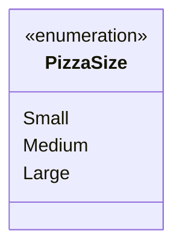

Corrisponde all'enum in [`PizzaSize.cs`](../../PizzaShop.Domain/PizzaSize.cs). È un semplice elenco di valori
possibili (`Small`, `Medium`, `Large`) — non ha visibilità `+` perché i valori di un `enum` sono per natura
pubblici e non sono né campi né metodi in senso classico.

> **Nota**: nel codice reale esiste anche `PizzaSizeExtensions.BasePrice()`, un *extension method* che calcola
> il prezzo base per formato con valori hardcoded (`Small` = 5.00, `Medium` = 7.50, `Large` = 10.00). Qui il
> diagramma lo tratta come un dato di menu configurabile dal proprietario della pizzeria, esattamente come i
> topping — vedi la sezione seguente ([`IPizzaSizeRepository`](#43bis-ipizzasizerepository)). L'extension
> method non è stato disegnato come classe a sé per non appesantire il diagramma con un dettaglio di
> implementazione (non è un concetto di dominio, ma un modo C#-specifico di "aggiungere" un metodo a un enum
> dall'esterno).

### 4.3bis `IPizzaSizeRepository`

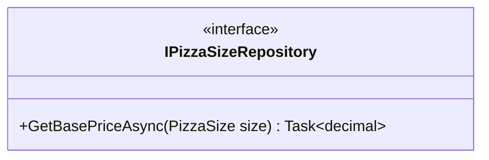

È il confine (contratto) verso il **Data Access Component**, lo stesso ruolo che `IToppingRepository` ha per i
topping: dato un `PizzaSize`, restituisce il prezzo base configurato per quel formato, letto da un database in
modo asincrono (`Task<decimal>`). Come per gli altri repository, l'implementazione concreta non compare in
questo diagramma perché appartiene a un altro componente.

> **Perché non è `Pizza` a dipendere direttamente da `IPizzaSizeRepository`?** Per lo stesso motivo per cui
> `Pizza`/`Order` non dipendono direttamente da `IPricingSettingsRepository` (vedi la nota nella sezione
> [4.9](#49-ipricingsettingsrepository)): `Pizza` è un'entità di dominio e deve restare facile da istanziare e
> testare, senza sapere da dove arrivano i dati. Il prezzo base viene quindi risolto **prima** di creare la
> pizza (tipicamente dall'Order API, chiamando `GetBasePriceAsync(size)`) e passato al **costruttore** di
> `Pizza` (`new Pizza(size, basePrice)`), che lo conserva in `_basePrice`. `CalculatePrice()` lo userà poi
> senza bisogno di riceverlo di nuovo come parametro a ogni chiamata.

### 4.4 `Topping`

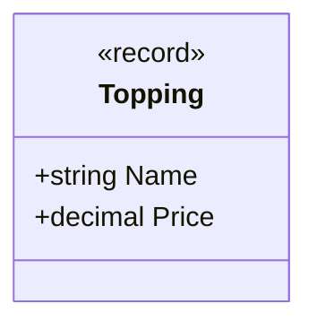

Corrisponde a [`Topping.cs`](../../PizzaShop.Domain/Topping.cs): un ingrediente extra, con nome e prezzo. È uno
stereotipo `<<record>>` perché nel codice è dichiarato come `public sealed record Topping(string Name, decimal Price)`
— un record C#, tipicamente immutabile e con uguaglianza per valore (due `Topping` con stesso nome e prezzo sono
considerati uguali).

### 4.5 `ToppingCatalog`

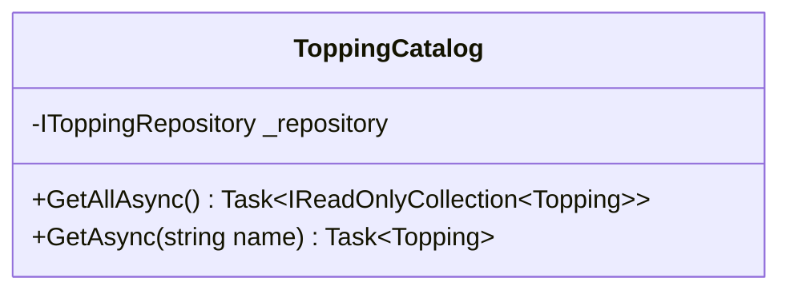

> **Nota**: questa versione è diversa da [`ToppingCatalog.cs`](../../PizzaShop.Domain/ToppingCatalog.cs), che
> nel progetto demo è `public static class ToppingCatalog` con un dizionario hardcoded in memoria (nessun
> database). Qui il diagramma mostra deliberatamente una versione più **realistica**: topping e prezzi letti
> da un database tramite il [Data Access Component](03-component-diagram.md), non un catalogo statico fisso
> nel codice. Vedi la sezione 4.6 per l'interfaccia `IToppingRepository` introdotta a questo scopo.

È il catalogo di ingredienti disponibili, reso disponibile all'esterno tramite due operazioni:

- `_repository`: dipendenza privata verso l'astrazione di persistenza (campo, non parametro di metodo — viene
  iniettata una volta, tipicamente nel costruttore, e riusata a ogni chiamata).
- `GetAllAsync()`: tutti gli ingredienti disponibili, letti dal database.
- `GetAsync(string name)`: cerca un ingrediente per nome, letto dal database (lancia eccezione/ritorna
  `null` se non esiste, a seconda della convenzione scelta).

I metodi sono **asincroni** (`Task<...>`) perché leggere da un database è un'operazione di I/O: bloccare un
thread in attesa di una risposta di rete/disco sarebbe uno spreco di risorse, specialmente in un'applicazione
web con molte richieste concorrenti (coerente con `Order API` implementata come ASP.NET Core Web API nel
[Component Diagram](03-component-diagram.md)).

### 4.6 `IToppingRepository`

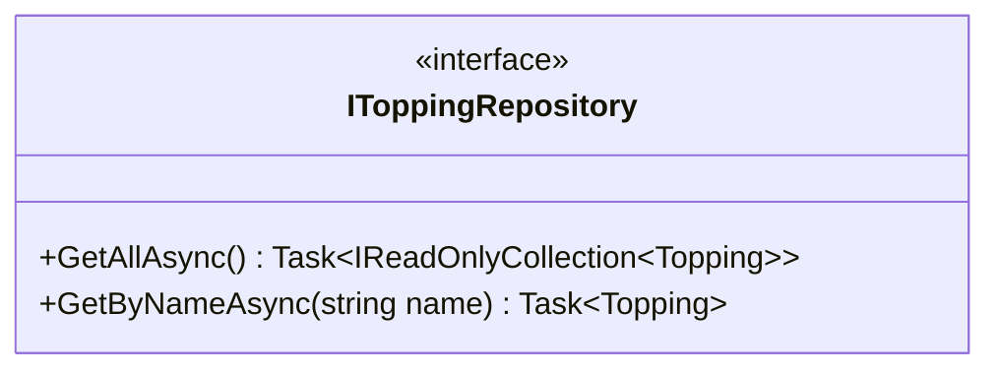

È il confine (contratto) tra l'**Order Management Component** e il **Data Access Component**: `ToppingCatalog`
conosce solo questa interfaccia, non sa nulla di SQL, stringhe di connessione o ORM usati per implementarla.
L'implementazione concreta (es. `SqlToppingRepository`) non compare in questo diagramma perché appartiene a un
altro componente — esattamente come, nell'esempio ufficiale del C4 Model, `CoreBankingSystemConnection`
incapsula i dettagli di rete senza esporli a chi la usa. Lo stereotipo `<<interface>>` segnala che si tratta di
un contratto (`public interface IToppingRepository` in C#), non di una classe concreta istanziabile.

### 4.7 Perché non c'è più `DiscountPolicy`

Nel codice demo attuale esiste una classe [`DiscountPolicy.cs`](../../PizzaShop.Domain/DiscountPolicy.cs), con
una soglia (`DiscountThreshold = 30.00`) e una percentuale (`DiscountRate = 0.10`) fisse, usata da `Order` per
calcolare `Discount()` e `TotalAfterDiscount()`. In questo diagramma la logica di sconto è stata **rimossa del
tutto**, per semplificare il modello: niente classe `DiscountPolicy`, niente `Discount()`/`TotalAfterDiscount()`
su `Order` (vedi [sezione 4.2](#42-order)). Il totale finale si calcola quindi direttamente da `Subtotal()` più
l'eventuale costo di consegna.

### 4.8 `PricingSettings`

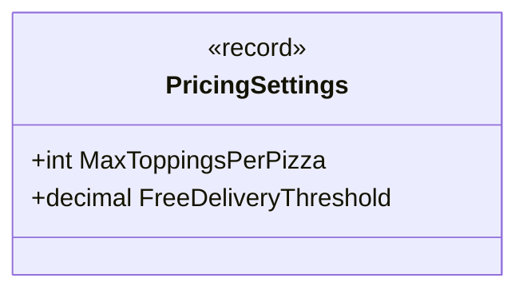

È un semplice contenitore dati (per questo è uno stereotipo `<<record>>`, come `Topping`): raggruppa le regole di
business che il proprietario della pizzeria può modificare — il numero massimo di topping per pizza e la soglia
di consegna gratuita. Non contiene logica, solo valori: chi la usa (`Pizza`, `Order`) la riceve già pronta come
parametro, senza sapere da dove arriva.

> **Nota**: nel codice demo attuale `FreeDeliveryThreshold = 25.00` è una costante dichiarata dentro `Order`.
> Qui il diagramma la rende **configurabile dal proprietario della pizzeria** (quindi letta da un database),
> esattamente come il limite di topping di `Pizza` — vedi la sezione 5.3 per il perché `Order` resta comunque
> un'entità "pura" invece di dipendere direttamente da un repository.

### 4.9 `IPricingSettingsRepository`

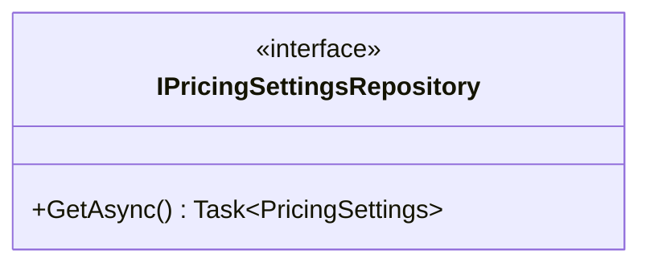

È il confine (contratto) verso il **Data Access Component**, lo stesso ruolo che `IToppingRepository` ha per i
topping: incapsula la lettura delle impostazioni da un database, restituendole come `PricingSettings` tramite
un metodo asincrono (`Task<...>`), coerentemente col fatto che leggere da un DB è un'operazione di I/O.
L'implementazione concreta non compare in questo diagramma, perché appartiene a un altro componente.

> **Perché non è `Pizza`/`Order` a dipendere direttamente da `IPricingSettingsRepository`, come invece
> fa `ToppingCatalog` con `IToppingRepository`?** `ToppingCatalog` è un piccolo servizio applicativo, mentre
> `Pizza` e `Order` rappresentano entità di dominio: farle dipendere da un repository le
> renderebbe più difficili da istanziare e testare, e mescolerebbe "cosa sono" con "da dove arrivano i dati".
> Per questo qui si è scelto un livello di indirezione in più: qualcosa a monte (tipicamente l'Order API, non
> mostrato in questo diagramma perché fuori scope dell'Order Management Component) chiama
> `IPricingSettingsRepository.GetAsync()` una volta e passa il risultato (`PricingSettings`) a valle, come
> semplice parametro.

---

## 5. Le relazioni tra le classi

Dopo le classi, il diagramma dichiara come sono collegate tra loro:

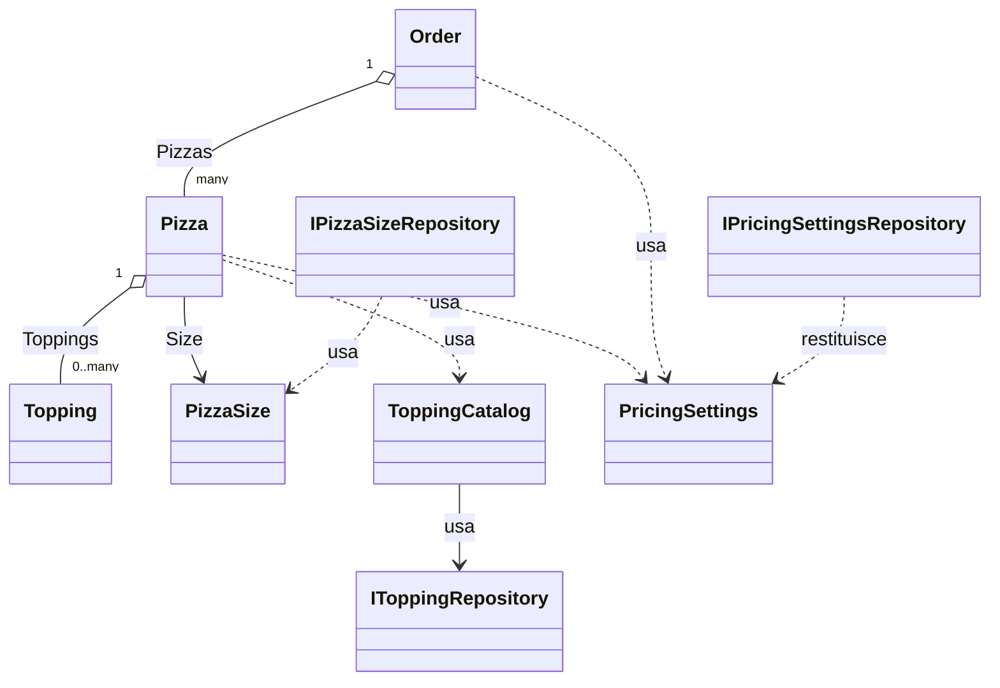

Ci sono **tre tipi diversi** di relazione, ognuna con un significato UML preciso.

### 5.1 Aggregazione (`o--`) — "ha un/ha molti" con cardinalità

```
Order "1" o-- "many" Pizza : Pizzas
Pizza "1" o-- "0..many" Topping : Toppings
```

Il simbolo `o--` disegna una linea continua con un **cerchio vuoto** (○) dal lato della classe "contenitore"
(qui `Order` e `Pizza`). Significa: "questa classe contiene una collezione dell'altra classe come parte del suo
stato".

- `Order "1" o-- "many" Pizza`: **1** `Order` contiene **molte** `Pizza` (nell'attributo `Pizzas`).
- `Pizza "1" o-- "0..many" Topping`: **1** `Pizza` contiene **da 0 a molti** `Topping` (nell'attributo `Toppings`
  — una pizza può anche non avere ingredienti extra).

Le etichette `"1"`, `"many"`, `"0..many"` sono le **cardinalità/moltiplicità**: si leggono sempre dal lato della
classe più vicina all'etichetta. L'etichetta finale (`: Pizzas`, `: Toppings`) indica il **nome della proprietà**
nel codice che realizza quella relazione.

> **Perché aggregazione (○) e non composizione (●)?** In UML la composizione (cerchio pieno) indicherebbe che
> l'oggetto "contenuto" non ha senso di esistere senza il "contenitore" (se elimini l'`Order`, le sue `Pizza`
> smettono di esistere logicamente). Qui è stata scelta la semantica più leggera (aggregazione) perché a questo
> livello di dettaglio didattico non è un punto critico da forzare, anche se concettualmente si potrebbe
> discutere che sia più corretta la composizione.

### 5.2 Associazione diretta (`-->`) — riferimento a un tipo

```
Pizza --> PizzaSize : Size
ToppingCatalog --> IToppingRepository : usa
```

> `IPricingSettingsRepository ..> PricingSettings : restituisce` usa invece una dipendenza tratteggiata
> (sezione 5.3), non un'associazione: l'interfaccia non "possiede" un `PricingSettings`, lo produce e lo
> restituisce come valore di ritorno del metodo `GetAsync()`.

La freccia continua **piena** (`-->`) indica che la classe di partenza ha un riferimento diretto a quella di
arrivo, tenuto come campo/proprietà. È una relazione più "debole" dell'aggregazione: non è una collezione, è
un singolo valore che la classe usa come proprio attributo tipizzato.

- `Pizza --> PizzaSize : Size`: `Pizza` ha un riferimento diretto a `PizzaSize` tramite la proprietà `Size`.
- `ToppingCatalog --> IToppingRepository : usa`: `ToppingCatalog` tiene un riferimento diretto
  all'interfaccia `IToppingRepository` (il campo privato `_repository` visto nella sezione 4.5) — lo tiene
  come dipendenza stabile per tutta la vita dell'oggetto, non lo crea/scarta a ogni chiamata come farebbe una
  dipendenza (`..>`).

### 5.3 Dipendenza (`..>`) — "usa, senza possedere"

```
Pizza ..> ToppingCatalog : usa
Pizza ..> PricingSettings : usa
Order ..> PricingSettings : usa
IPizzaSizeRepository ..> PizzaSize : usa
```

La freccia **tratteggiata** (`..>`) indica una **dipendenza**: `Pizza` e `Order` *chiamano* metodi/usano dati di
`ToppingCatalog` e `PricingSettings`, ma non li tengono come campo/proprietà — è un uso "di passaggio" (es.
`ToppingCatalog.GetAsync(...)` viene chiamato quando serve, non è salvato da nessuna parte dentro `Pizza`).

Per `ToppingCatalog` il motivo è che, pur non essendo `<<static>>` in questa versione "realistica", `Pizza` la
userebbe comunque solo per una singola chiamata puntuale, senza bisogno di tenerla come proprio stato interno.

`Pizza ..> PricingSettings` e `Order ..> PricingSettings` seguono una logica analoga: entrambe ricevono
un `PricingSettings` come **parametro di metodo** (`AddTopping(..., settings)`, `HasFreeDelivery(settings)`,
`DeliveryFee(settings)`, `GrandTotal(settings)`), lo leggono e lo scartano — non lo tengono come campo. È
esattamente questa scelta (dipendenza "di passaggio" invece di un'associazione stabile come
`ToppingCatalog --> IToppingRepository`) che permette a `Pizza` e `Order` di restare entità di dominio pure,
senza mai dipendere direttamente da un repository.

`IPizzaSizeRepository ..> PizzaSize : usa` segue lo stesso principio delle relazioni "di ritorno" viste sopra
per `IPricingSettingsRepository`: l'interfaccia usa `PizzaSize` come chiave di ricerca del proprio metodo
(`GetBasePriceAsync(PizzaSize size)`), senza possederlo come campo.

### 5.4 Riepilogo differenze linea/freccia

| Notazione Mermaid | Nome UML | Linea | Significato |
|---|---|---|---|
| `o--` | Aggregazione | Continua, cerchio vuoto | "Ha una collezione di" (contenitore/contenuto) |
| `-->` | Associazione | Continua, freccia piena | "Ha un riferimento a" (singolo valore tipizzato) |
| `..>` | Dipendenza | Tratteggiata, freccia aperta | "Usa temporaneamente", senza possedere |

---

## 6. Diagramma completo commentato

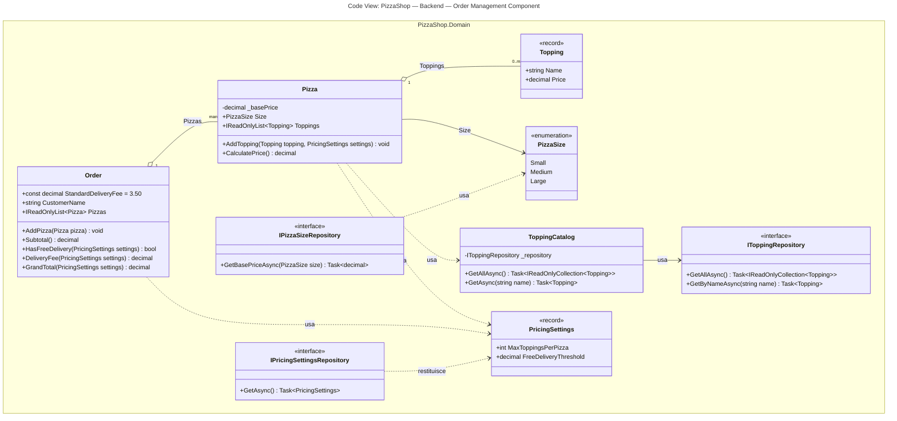

*Come già anticipato nella [sezione 2](#2-il-box-del-componente-namespace), il riquadro `PizzaShop.Domain` e il
titolo `Code View: PizzaShop — Backend — Order Management Component` rendono esplicito, direttamente
nell'immagine renderizzata, che questo è il code-view di un singolo componente — l'Order Management Component
— e non dell'intero sistema PizzaShop.*

**Lettura d'insieme, dall'alto verso il basso:**

1. Un `Order` **aggrega** più `Pizza` (relazione 1→molti).
2. Ogni `Pizza` **aggrega** da 0 a molti `Topping` (relazione 1→0..molti) e **ha un** `PizzaSize`.
3. `Pizza` **dipende da** `ToppingCatalog` per recuperare gli ingredienti disponibili (ma non lo possiede).
4. `ToppingCatalog` **ha un riferimento a** `IToppingRepository` per leggere topping e prezzi da un database,
   senza conoscerne i dettagli implementativi (delegati al Data Access Component). Allo stesso modo,
   `IPizzaSizeRepository` **usa** `PizzaSize` per recuperare da un database il prezzo base associato a quel
   formato, senza che `Pizza` dipenda direttamente da questo repository (vedi punto 5).
5. `Pizza` e `Order` **dipendono da** `PricingSettings` (limite topping e soglia di consegna gratuita
   configurabili dal proprietario), ricevuto come parametro invece che tramite un repository iniettato:
   restano così entità di dominio pure, mentre è `IPricingSettingsRepository` a occuparsi di produrre
   quel valore leggendolo da un database. Il prezzo base per formato segue una logica simile ma non identica:
   risolto tramite `IPizzaSizeRepository` **prima** di creare la pizza e passato al **costruttore**
   (`new Pizza(size, basePrice)`), che lo conserva in `_basePrice` — per questo `CalculatePrice()` non ha
   bisogno di riceverlo a ogni chiamata come fanno invece `AddTopping(..., settings)` o `GrandTotal(settings)`
   con `PricingSettings`.
6. `Topping` e `PricingSettings` sono record immutabili, `IToppingRepository`/`IPricingSettingsRepository`/
   `IPizzaSizeRepository` sono interfacce, `PizzaSize` è un enum — diverse "nature" di classe, segnalate dagli
   stereotipi.
7. Non compare più alcuna logica di sconto: `Order` calcola il totale finale direttamente da `Subtotal()` e
   dall'eventuale costo di consegna (`DeliveryFee(settings)`), senza passare da una classe `DiscountPolicy`.

Per vedere **quando** questi metodi vengono effettivamente chiamati, e in che ordine, consulta il
[sequence diagram](05-sequence-diagram.md), che descrive il flusso del caso d'uso "composizione di un ordine e
calcolo del totale" usando esattamente queste classi.
