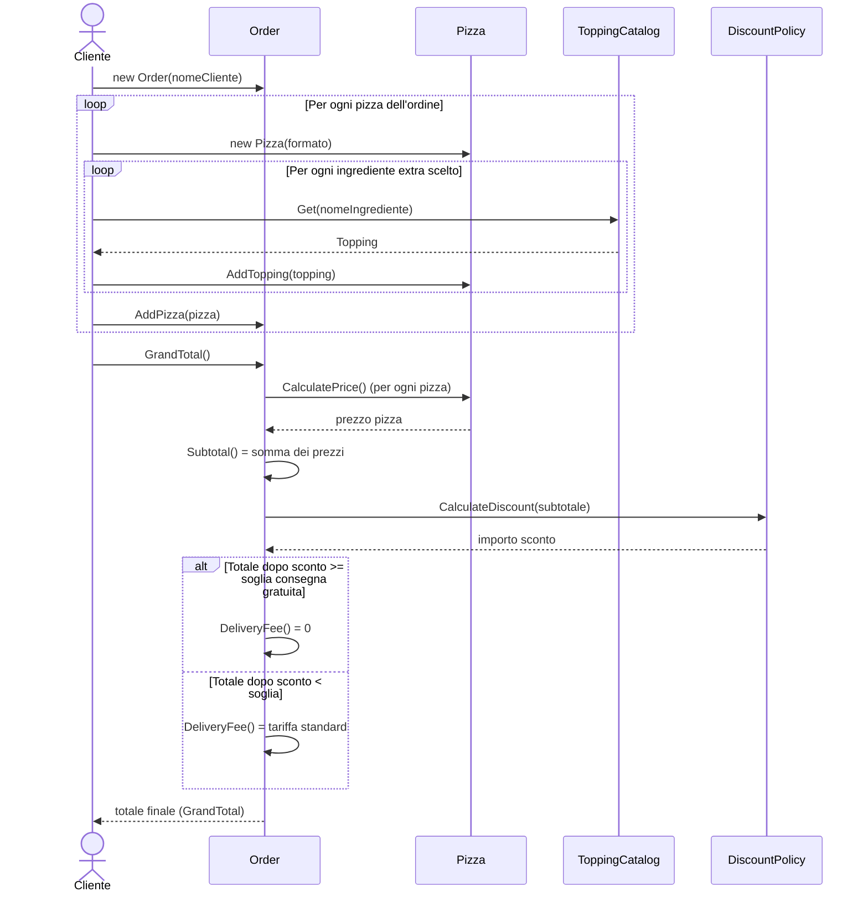

# Livello 4 — Sequence Diagram

Il cliente ci ha chiesto esplicitamente, per il livello 4 (Code), **almeno un sequence diagram e un class
diagram** ("UML puro"), oltre ai 4 livelli standard del C4 Model. Il [class diagram](04-code-level-note.md) è già
documentato; questo file aggiunge il sequence diagram, con la sintassi `sequenceDiagram` di Mermaid.

Il diagramma descrive il **caso d'uso scelto per la demo**: *"Il cliente compone un ordine con una o più pizze,
personalizzate con ingredienti extra, e ne viene calcolato il totale finale (sconto e spese di consegna
incluse)"* — lo stesso caso d'uso rappresentato nei diagrammi [Context](01-system-context.md),
[Container](02-container-diagram.md) e [Component](03-component-diagram.md).

## Note di lettura
- `actor` / `participant`: gli attori/oggetti coinvolti nello scambio di messaggi. Qui `Cliente` è la persona che
  usa il sistema, gli altri sono le classi C# reali che compongono l'**Order Management Component** del
  [Component Diagram](03-component-diagram.md), descritte nel dettaglio nel [class diagram](04-code-level-note.md).
- `loop ... end`: rappresenta un'iterazione (qui: più pizze nell'ordine, e più ingredienti extra per pizza).
- `alt ... else ... end`: rappresenta una diramazione condizionale (qui: se l'ordine supera o meno la soglia di
  consegna gratuita).
- Le frecce continue (`->>`) sono chiamate sincrone; le frecce tratteggiate (`-->>`) sono le risposte/ritorni.

## Corrispondenza con il codice
Questo flusso rispecchia fedelmente `Program.cs` (la demo console) e i metodi pubblici di
[`Order.cs`](../../PizzaShop.Domain/Order.cs), [`Pizza.cs`](../../PizzaShop.Domain/Pizza.cs),
[`ToppingCatalog.cs`](../../PizzaShop.Domain/ToppingCatalog.cs) e
[`DiscountPolicy.cs`](../../PizzaShop.Domain/DiscountPolicy.cs). È anche lo stesso scenario descritto in
linguaggio naturale nelle feature Gherkin di `PizzaShop.Bdd.Tests/Features/`.
