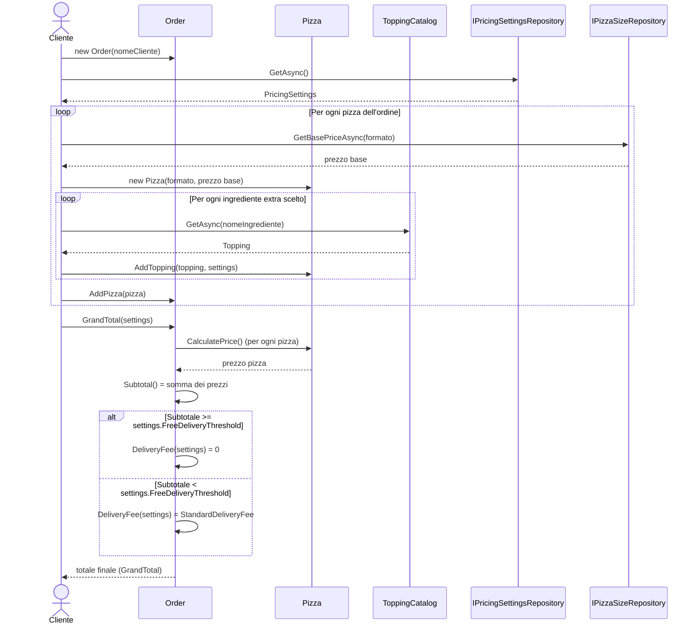

# Livello 4 — Sequence Diagram

Per il livello 4 (Code) i requisiti di documentazione prevedono, oltre ai 4 livelli standard del C4 Model,
**almeno un sequence diagram e un class diagram** ("UML puro"). Il [class diagram](04-code-level-note.md) è già
documentato; questo file aggiunge il sequence diagram, con la sintassi `sequenceDiagram` di Mermaid.

Il diagramma descrive il **caso d'uso scelto per la demo**: *"Il cliente compone un ordine con una o più pizze,
personalizzate con ingredienti extra entro un limite massimo, e ne viene calcolato il totale finale (spese di
consegna incluse)"* — lo stesso caso d'uso rappresentato nei diagrammi [Context](01-system-context.md),
[Container](02-container-diagram.md) e [Component](03-component-diagram.md).

## Note di lettura
- `actor` / `participant`: gli attori/oggetti coinvolti nello scambio di messaggi. Qui `Cliente` è la persona che
  usa il sistema, gli altri sono le classi/interfacce C# reali che compongono l'**Order Management Component**
  del [Component Diagram](03-component-diagram.md), descritte nel dettaglio nel
  [class diagram](04-code-level-note.md).
- `loop ... end`: rappresenta un'iterazione (qui: più pizze nell'ordine, e più ingredienti extra per pizza).
- `alt ... else ... end`: rappresenta una diramazione condizionale (qui: se l'ordine supera o meno la soglia di
  consegna gratuita).
- Le frecce continue (`->>`) sono chiamate sincrone; le frecce tratteggiate (`-->>`) sono le risposte/ritorni.
- `Cliente->>PricingSettingsRepository: GetAsync()` viene mostrato subito dopo la creazione dell'ordine, perché
  `settings` (limite topping e soglia di consegna gratuita) viene caricato una volta e poi passato come
  parametro a `Pizza.AddTopping(...)` e ai metodi di `Order` che ne hanno bisogno — coerentemente con la scelta
  di design spiegata in [04-code-level-note.md](04-code-level-note.md) (`Pizza` e `Order` restano entità "pure",
  senza dipendere direttamente da un repository).
- `Cliente->>PizzaSizeRepository: GetBasePriceAsync(formato)` viene chiamato **prima** di creare ogni `Pizza`,
  non al momento del calcolo del totale: il prezzo base risolto viene passato direttamente al costruttore
  (`new Pizza(formato, prezzo base)`), che lo conserva internamente. Per questo `Pizza.CalculatePrice()` non ha
  bisogno di alcun parametro — restituisce semplicemente `_basePrice + somma dei topping` — ed `Order.Subtotal()`
  può sommare i prezzi di tutte le pizze senza dover conoscere da dove arriva il prezzo base di ciascuna.

## Corrispondenza con il codice
Questo flusso rispecchia fedelmente `Program.cs` (la demo console) e i metodi pubblici di
[`Order.cs`](../../PizzaShop.Domain/Order.cs), [`Pizza.cs`](../../PizzaShop.Domain/Pizza.cs) e
[`ToppingCatalog.cs`](../../PizzaShop.Domain/ToppingCatalog.cs). È anche lo stesso scenario descritto in
linguaggio naturale nelle feature Gherkin di `PizzaShop.Bdd.Tests/Features/`.

> **Nota**: rispetto al codice demo attuale questo diagramma riflette le stesse semplificazioni/modifiche
> intenzionali del [class diagram](04-code-level-note.md): niente più `DiscountPolicy` (la logica di sconto è
> stata rimossa), e `ToppingCatalog`/`PricingSettings` sono mostrati nella loro forma "realistica" (letti da un
> database), non come l'attuale implementazione demo in memoria con costanti hardcoded.
