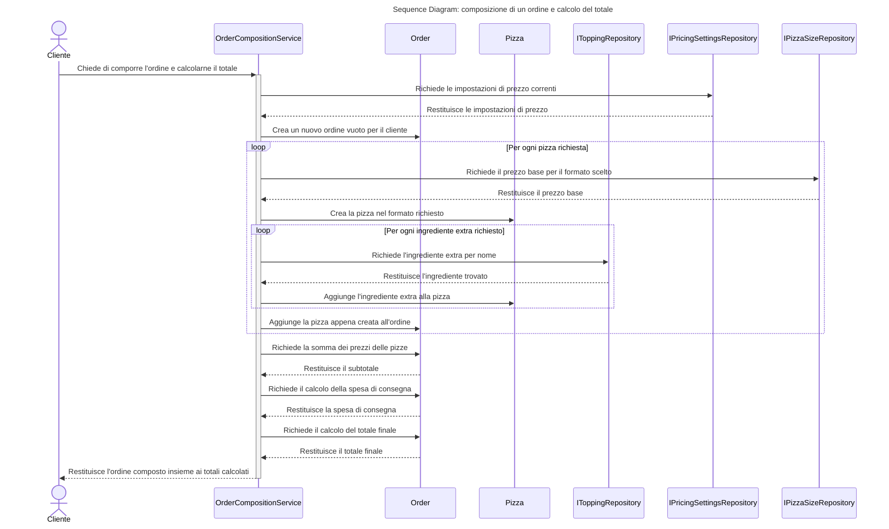

# Livello 4 — Sequence Diagram

Per il livello 4 (Code) i requisiti di documentazione prevedono, oltre ai 4 livelli standard del C4 Model,
**almeno un sequence diagram e un class diagram** ("UML puro"). Il [class diagram](04-code-level-note.md) è già
documentato; questo file aggiunge il sequence diagram, con la sintassi `sequenceDiagram` di Mermaid.

Il diagramma descrive il **caso d'uso scelto per la demo**: *"Il cliente compone un ordine con una o più pizze,
personalizzate con ingredienti extra entro un limite massimo, e ne viene calcolato il totale finale (spese di
consegna incluse)"* — lo stesso caso d'uso rappresentato nei diagrammi [Context](01-system-context.md),
[Container](02-container-diagram.md) e [Component](03-component-diagram.md).

```mermaid
---
title: "Sequence Diagram: composizione di un ordine e calcolo del totale"
---
sequenceDiagram
	actor Cliente
	participant OrderCompositionService
	participant Order
	participant Pizza
	participant ToppingRepository as IToppingRepository
	participant PricingSettingsRepository as IPricingSettingsRepository
	participant PizzaSizeRepository as IPizzaSizeRepository

	Cliente->>+OrderCompositionService: Chiede di comporre l'ordine e calcolarne il totale
	OrderCompositionService->>PricingSettingsRepository: Richiede le impostazioni di prezzo correnti
	PricingSettingsRepository-->>OrderCompositionService: Restituisce le impostazioni di prezzo
	OrderCompositionService->>Order: Crea un nuovo ordine vuoto per il cliente

	loop Per ogni pizza richiesta
		OrderCompositionService->>PizzaSizeRepository: Richiede il prezzo base per il formato scelto
		PizzaSizeRepository-->>OrderCompositionService: Restituisce il prezzo base
		OrderCompositionService->>Pizza: Crea la pizza nel formato richiesto
		loop Per ogni ingrediente extra richiesto
			OrderCompositionService->>ToppingRepository: Richiede l'ingrediente extra per nome
			ToppingRepository-->>OrderCompositionService: Restituisce l'ingrediente trovato
			OrderCompositionService->>Pizza: Aggiunge l'ingrediente extra alla pizza
		end
		OrderCompositionService->>Order: Aggiunge la pizza appena creata all'ordine
	end

	OrderCompositionService->>Order: Richiede la somma dei prezzi delle pizze
	Order-->>OrderCompositionService: Restituisce il subtotale
	OrderCompositionService->>Order: Richiede il calcolo della spesa di consegna
	Order-->>OrderCompositionService: Restituisce la spesa di consegna
	OrderCompositionService->>Order: Richiede il calcolo del totale finale
	Order-->>OrderCompositionService: Restituisce il totale finale

	OrderCompositionService-->>-Cliente: Restituisce l'ordine composto insieme ai totali calcolati

```

> Il titolo `Sequence Diagram: composizione di un ordine e calcolo del totale` è definito nel frontmatter
> `title:` del blocco Mermaid (non solo nel testo Markdown sopra): Mermaid lo disegna *dentro* l'immagine
> renderizzata, sopra il diagramma stesso, esattamente come già fatto per il [class diagram](04-code-level-note.md).
> Questo rende esplicito il caso d'uso rappresentato anche se il diagramma viene esportato o incollato altrove
> come immagine isolata — è la stessa esigenza, ma qui ancora più sentita: un sequence diagram descrive *un solo*
> scenario specifico, quindi sapere a colpo d'occhio quale caso d'uso stiamo guardando è particolarmente utile.

## Note di lettura
- `actor` / `participant`: gli attori/oggetti coinvolti nello scambio di messaggi. Qui `Cliente` è la persona che
  usa il sistema, gli altri sono le classi/interfacce C# reali che compongono l'**Order Management Component**
  del [Component Diagram](03-component-diagram.md), descritte nel dettaglio nel
  [class diagram](04-code-level-note.md). `Cliente` non parla mai direttamente con i repository
  (`IPizzaSizeRepository`, `IPricingSettingsRepository`, `IToppingRepository`), né con `Pizza`/`Order`: parla
  solo con `OrderCompositionService`, che è il vero consumer di quelle dipendenze e l'unico che crea/assembla
  un `Order` (vedi [04-code-level-note.md](04-code-level-note.md) e
  [04a-class-diagram-spiegazione.md](04a-class-diagram-spiegazione.md#49-ordercompositionservice)).
- `loop ... end`: rappresenta un'iterazione (qui: più pizze da comporre, e più ingredienti extra per pizza).
- `alt ... else ... end`: non compare più in questo diagramma, perché la diramazione "consegna gratuita o a
  pagamento" è ora incapsulata dentro `Order.DeliveryFee(settings)`, invocato come singola chiamata da
  `OrderCompositionService` — resta comunque descritta nel dettaglio in
  [Order.cs](../../PizzaShop.Domain/Order.cs) e nella sezione 4 del [class diagram](04-code-level-note.md).
- Le frecce continue (`->>`) sono chiamate sincrone; le frecce tratteggiate (`-->>`) sono le risposte/ritorni.
- Le etichette sulle frecce sono scritte in linguaggio naturale (es. "Aggiunge la pizza appena creata all'ordine")
  invece di riportare la firma esatta del metodo C# (es. `AddPizza(pizza)`): questa scelta privilegia la
  leggibilità per chi presenta o guarda il diagramma senza conoscere il codice, a costo di perdere la
  tracciabilità diretta col nome del metodo — per quella si veda la sezione
  [Corrispondenza con il codice](#corrispondenza-con-il-codice) più sotto.
- Il rettangolo verticale stretto sopra la lifeline di `OrderCompositionService` è la sua **activation bar**
  (detta anche *focus of control*): indica il periodo in cui `OrderCompositionService` è effettivamente attivo,
  cioè sta eseguendo codice o è in attesa di una risposta a una chiamata fatta da lui. In Mermaid si ottiene con
  `+`/`-` sulle frecce (`->>+` per attivare, `-->>-` per disattivare). Qui è attivato **una sola volta, per
  l'intera durata** dell'interazione: il `Cliente` fa un'unica richiesta e resta fermo ad aspettare un'unica
  risposta, con ordine e totali già calcolati.
- "Chiede di comporre l'ordine e calcolarne subito il totale" (in codice: `CreateOrderWithTotalsAsync(nomeCliente,
  richiestePizze)`) è l'**unica** chiamata che il cliente fa: gli basta descrivere *cosa* vuole (una collezione
  di `PizzaOrderRequest`, ciascuna con formato e nomi dei topping desiderati) e riceve indietro sia l'`Order`
  composto sia l'`OrderTotals` già calcolato. Nessuno chiama mai `new Order(...)`, `new Pizza(...)` o
  `order.AddPizza(...)` direttamente: tutta questa orchestrazione avviene dentro `OrderCompositionService`, che
  risolve le impostazioni di pricing **una sola volta**, all'inizio, e le riusa sia per ogni
  `Pizza.AddTopping(...)` del ciclo sia per il calcolo finale di spesa di consegna e totale — coerentemente con
  la scelta di design spiegata in [04-code-level-note.md](04-code-level-note.md) (`Pizza` e `Order` restano
  entità "pure", senza dipendere direttamente da un repository).
- Il prezzo base per formato viene risolto **prima** di creare ogni `Pizza`, non al momento del calcolo del
  totale: il prezzo base risolto viene passato direttamente al costruttore (`new Pizza(formato, prezzo base)`),
  che lo conserva internamente. Per questo `Pizza.CalculatePrice()` non ha bisogno di alcun parametro —
  restituisce semplicemente `_basePrice + somma dei topping` — ed `Order.Subtotal()` può sommare i prezzi di
  tutte le pizze senza dover conoscere da dove arriva il prezzo base di ciascuna.
- Le impostazioni di prezzo vengono richieste **una sola volta**, subito dopo la richiesta del cliente, prima
  ancora di creare l'`Order`: `CreateOrderWithTotalsAsync` risolve `PricingSettings` una volta sola e la passa
  internamente sia alla fase di composizione (validazione dei topping) sia alla fase di calcolo dei totali
  (spesa di consegna e totale finale), evitando una seconda interrogazione ridondante verso
  `IPricingSettingsRepository`. Il `Cliente` non deve mai leggere `PricingSettings` da solo né richiamare
  `Order.Subtotal()`/`DeliveryFee(...)`/`GrandTotal(...)` direttamente.

## Corrispondenza con il codice
Questo flusso rispecchia fedelmente il metodo `CreateOrderWithTotalsAsync` di
[`OrderCompositionService.cs`](../../PizzaShop.Domain/OrderCompositionService.cs), che risolve
`PricingSettings` una sola volta e la passa ai metodi privati `ComposeOrderAsync` e `ComputeTotals` — oltre a
[`Order.cs`](../../PizzaShop.Domain/Order.cs),
[`Pizza.cs`](../../PizzaShop.Domain/Pizza.cs) e
[`IToppingRepository.cs`](../../PizzaShop.Domain/IToppingRepository.cs).

> **Nota**: questo diagramma rispecchia il codice effettivamente presente: niente più `DiscountPolicy` (la
> logica di sconto è stata rimossa), e `IToppingRepository`/`PricingSettings`/`IPizzaSizeRepository` sono usati
> nella loro forma realistica (`PizzaShop.Domain` dipende solo dalle interfacce), sempre tramite
> `OrderCompositionService`, che resta l'unico punto che crea e assembla un `Order`. Oggi le uniche
> implementazioni di queste interfacce sono quelle hardcoded in memoria del progetto
> `PizzaShop.Infrastructure.InMemory`, che gioca lo stesso ruolo che avrebbe un vero Data Access Component
> basato su database.
