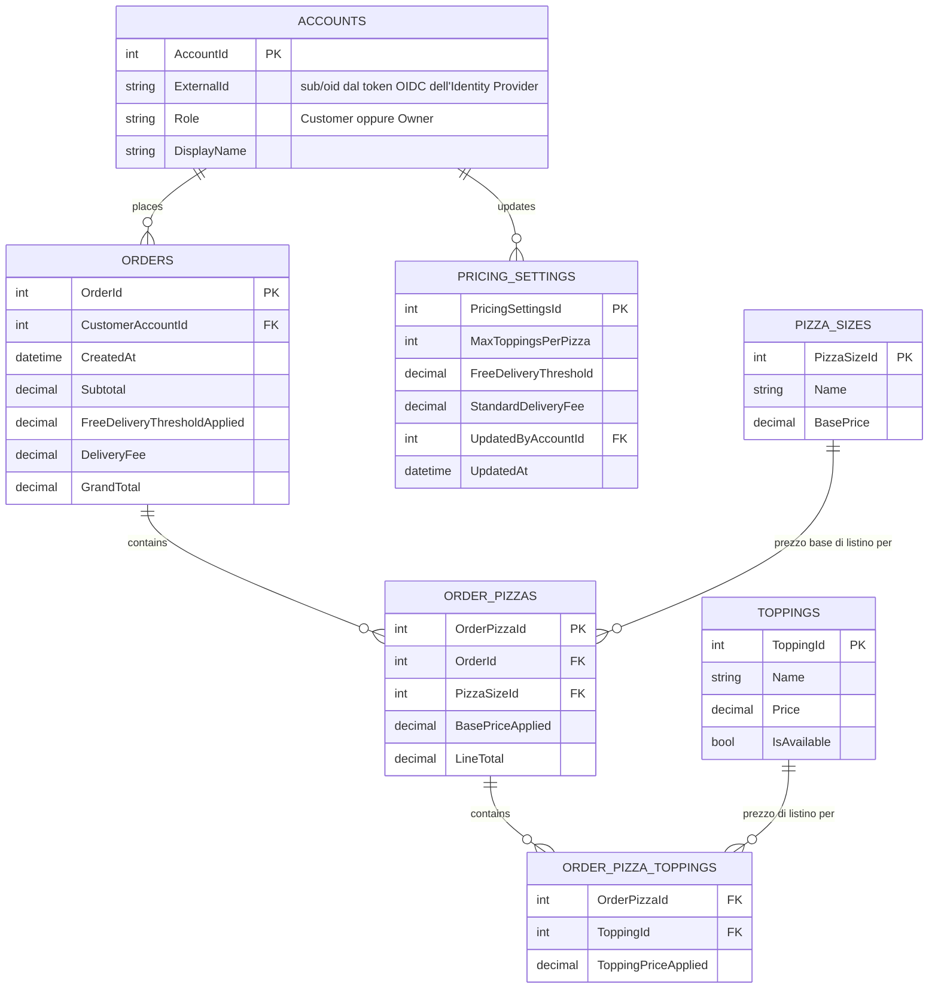

# Livello 4 — Persistenza (modello E/R)

Il livello **Code** del C4 Model, oltre al class diagram (vedi [04-code-level-note.md](04-code-level-note.md)) e al
sequence diagram (vedi [05-sequence-diagram.md](05-sequence-diagram.md)), può includere anche un **modello
Entità/Relazione (E/R)**, quando il componente analizzato dipende da un database — è esattamente il nostro caso: il
**Data Access Component** (vedi [03-component-diagram.md](03-component-diagram.md)) espone `IToppingRepository`,
`IPricingSettingsRepository` e `IPizzaSizeRepository`, e questo diagramma mostra **cosa c'è dietro** a quelle
interfacce, cioè lo schema del database che le implementazioni concrete andrebbero a interrogare.

> **Nota — stesso caveat degli altri documenti di Livello 4**: come il class diagram, anche questo modello E/R
> descrive il **design target realistico**, non lo stato attuale del codice demo. Nel progetto oggi non esiste
> ancora nessun database: `PizzaShop.Domain` calcola tutto in memoria con costanti hardcoded. Questo schema è
> quindi la base plausibile su cui si appoggerebbero `IToppingRepository`, `IPricingSettingsRepository` e
> `IPizzaSizeRepository` una volta implementati davvero.

## Decisioni di design assunte

Per restare fedeli al caso d'uso scelto (**Composizione di un ordine e calcolo del totale**) e coerenti con le
scelte già fatte negli altri livelli, questo modello E/R parte da tre assunzioni:

1. **Cliente e gestore come account "shadow" legati all'Identity Provider esterno**: il [Component Diagram](03-component-diagram.md)
   prevede già un **Security Component** che valida il token del cliente delegando a un Identity Provider esterno
   via OAuth2/OIDC — quindi il design target *non* è un semplice campo testuale come nel codice demo attuale
   (`Order(string customerName)`). L'Identity Provider resta l'unica fonte di verità per credenziali e login: il
   nostro database **non** salva password né duplica l'anagrafica completa. Serve però una tabella locale minima,
   `ACCOUNTS`, che colleghi l'identificativo esterno del token (`sub`/`oid`) ai dati che appartengono al nostro
   sistema — lo storico ordini per il cliente, l'autorizzazione a modificare il listino per il gestore. È il
   pattern standard "shadow record" usato quando l'autenticazione è delegata a un IdP esterno.
2. **Prezzi storicizzati per snapshot, non per versioning**: `PizzaSizes`, `Toppings` e `PricingSettings`
   rappresentano il **listino corrente** (modificabile dal gestore pizzeria). Per garantire che il totale di un
   ordine già eseguito non cambi retroattivamente se il gestore modifica un prezzo o le impostazioni in un secondo
   momento, i prezzi effettivamente applicati vengono **copiati (snapshot)** dentro le righe dell'ordine al momento
   della creazione, invece di essere ricalcolati leggendo le tabelle di listino. È lo stesso principio già visto nel
   class diagram: `Pizza` riceve `_basePrice` già risolto nel costruttore, non lo ricalcola ogni volta.
3. **Un solo ruolo per account**: per restare nello scope del caso d'uso (composizione ordine), `ACCOUNTS.Role`
   distingue solo `Customer` da `Owner`. Un modello con ruoli/permessi granulari (RBAC) sarebbe over-engineering
   per questo esempio didattico.

## Diagramma

> `PRICING_SETTINGS` non ha una relazione verso `ORDERS`: rappresenta una **regola di business letta al momento
> della composizione dell'ordine** (tramite `IPricingSettingsRepository.GetAsync()`, vedi il class diagram), non un
> dato collegato per chiave esterna. I valori di `FreeDeliveryThreshold` e `StandardDeliveryFee` effettivamente
> usati vengono comunque preservati come snapshot in `Orders.FreeDeliveryThresholdApplied` e `Orders.DeliveryFee`,
> per lo stesso motivo di storicizzazione spiegato sopra. `MaxToppingsPerPizza` invece è solo un **vincolo di
> validazione** al momento dell'aggiunta di un topping
> (`Pizza.AddTopping(topping, settings)`): non essendo un valore che influenza il totale già calcolato, non serve
> conservarne uno snapshot per riga d'ordine. Ha invece una relazione verso `ACCOUNTS` (`UpdatedByAccountId`), perché
> solo un account con `Role = Owner` può modificarla, ed è utile tracciare chi l'ha aggiornata l'ultima volta (una
> base minima di audit).

## Perché non c'è una tabella `Pizzas`/`Toppings` "di dominio" duplicata

`ORDER_PIZZAS` e `ORDER_PIZZA_TOPPINGS` **non** sono la stessa cosa delle classi `Pizza` e `Topping` del class
diagram: quelle sono oggetti di dominio in memoria, mentre queste tabelle sono le **righe di un ordine già
eseguito**, con i prezzi congelati al momento dell'acquisto. `PIZZA_SIZES` e `TOPPINGS` invece corrispondono al
**listino corrente** che alimenta `IPizzaSizeRepository` e `IToppingRepository`: sono le tabelle da cui si legge
il prezzo quando si compone un *nuovo* ordine, non quelle in cui si legge quando si consulta uno storico.

## Corrispondenza con le interfacce del Data Access Component

| Tabella | Interfaccia che la interroga | Uso |
|---|---|---|
| `PIZZA_SIZES` | `IPizzaSizeRepository` | `GetBasePriceAsync(size)` legge `BasePrice` per formato, al momento della creazione di una nuova pizza |
| `TOPPINGS` | `IToppingRepository` | `GetAllAsync()` / `GetByNameAsync(name)` leggono nome e prezzo dei topping disponibili (`IsAvailable = true`) |
| `PRICING_SETTINGS` | `IPricingSettingsRepository` | `GetAsync()` legge la riga corrente delle impostazioni (max topping, soglia consegna gratuita, costo di consegna standard) |
| `ACCOUNTS` | *(nessuna interfaccia ancora nel class diagram)* | Letta dal **Security Component** dopo la validazione del token (vedi [03-component-diagram.md](03-component-diagram.md)), per risolvere l'account locale a partire dall'`ExternalId`; richiederebbe un `IAccountRepository` non ancora modellato |
| `ORDERS` / `ORDER_PIZZAS` / `ORDER_PIZZA_TOPPINGS` | *(nessuna interfaccia ancora nel class diagram)* | Persistenza dell'ordine finale una volta calcolato; richiederebbe un `IOrderRepository` non ancora modellato, perché il caso d'uso scelto si ferma al calcolo del totale, non al salvataggio dell'ordine |

## Cosa è già implementato vs cosa è solo design

| Elemento | Stato |
|---|---|
| Calcolo di subtotale, delivery fee e totale in memoria (`Order`, `Pizza`) | ✅ Implementato (con valori ancora hardcoded, non da queste tabelle) |
| Tabelle `PIZZA_SIZES`, `TOPPINGS`, `PRICING_SETTINGS` (listino) | ❌ Solo design, nessun database esiste ancora |
| Tabelle `ORDERS`, `ORDER_PIZZAS`, `ORDER_PIZZA_TOPPINGS` (storico ordini) | ❌ Solo design: il codice demo non salva gli ordini da nessuna parte, li calcola e basta |
| Tabella `ACCOUNTS` | ❌ Solo design: nel codice demo non esiste autenticazione, `Order.CustomerName` è ancora una semplice stringa passata al costruttore |
| Un eventuale `IOrderRepository` per salvare l'ordine | ❌ Non ancora modellato: fuori dallo scope del caso d'uso scelto ("comporre un ordine e calcolarne il totale"), ma sarebbe il passo naturale successivo se si volesse anche *persistere* l'ordine eseguito |
| Un eventuale `IAccountRepository` per risolvere l'account dal token | ❌ Non ancora modellato: coerente col fatto che il Security Component/Identity Provider Adapter non hanno ancora un'implementazione concreta ([03-component-diagram.md](03-component-diagram.md)) |

Se in futuro il caso d'uso venisse esteso a "salvare l'ordine eseguito", basterebbe aggiungere `IOrderRepository`
al Data Access Component (vedi [03-component-diagram.md](03-component-diagram.md)) e collegarlo alle tabelle
`ORDERS`/`ORDER_PIZZAS`/`ORDER_PIZZA_TOPPINGS` già previste qui.
