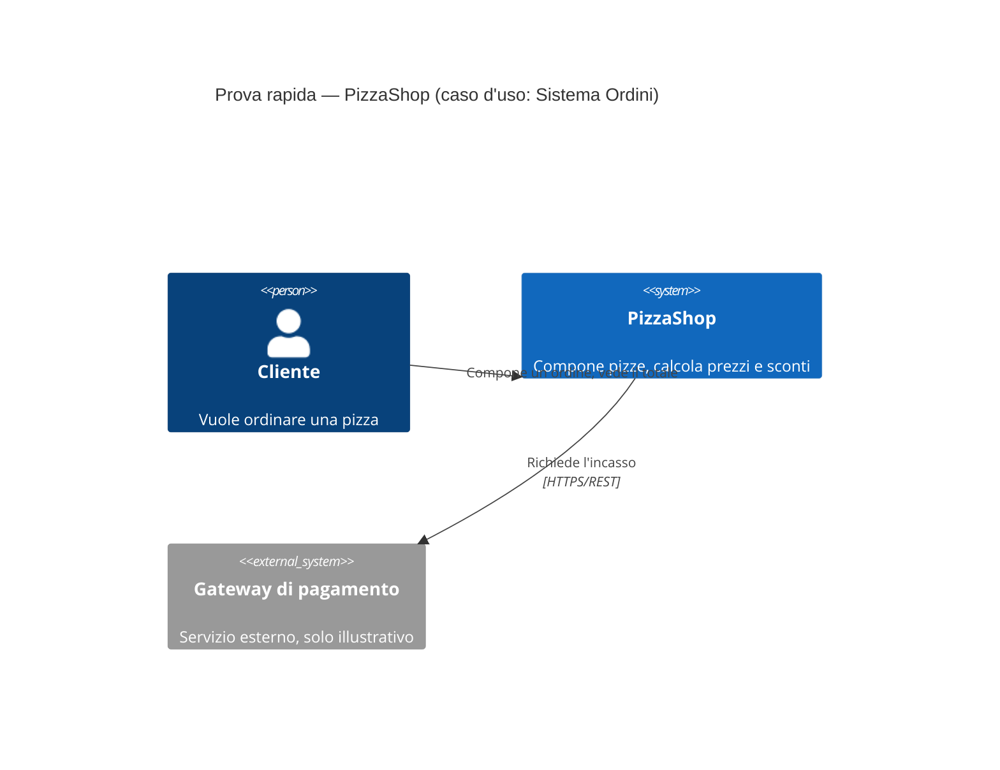

# Guida rapida a Mermaid (per il C4 Model)

Mermaid non è un programma da installare: è una libreria che trasforma del testo scritto con una sintassi
precisa in un diagramma. Tu scrivi solo del testo dentro un blocco di codice marcato ` ```mermaid `; il
disegno viene generato da chi legge quel testo con uno strumento compatibile.

## Come vederlo disegnato (nessuna installazione obbligatoria)

1. **[mermaid.live](https://mermaid.live)** — il modo più veloce: apri il sito, incolli il codice del
   diagramma (senza i tre backtick), il disegno appare subito a destra. Utile per provare al volo.
2. **GitHub / Azure DevOps** — se il file `.md` con un blocco ` ```mermaid ` è dentro un repository, la
   piattaforma lo renderizza automaticamente quando apri il file dal browser.
3. **VS Code** — installando l'estensione gratuita "Markdown Preview Mermaid Support" l'anteprima Markdown
   (`Ctrl+Shift+V`) mostra i diagrammi disegnati in locale.
4. **Visual Studio 2026** — l'editor Markdown integrato al momento mostra il blocco come semplice testo/codice,
   non lo disegna. Per vederlo renderizzato conviene usare una delle opzioni sopra.

In tutti i casi il file `.md` resta identico: è solo testo versionabile in Git, la parte "grafica" è una vista
opzionale generata da chi lo legge.

## Prova pratica

Copia il blocco qui sotto (dalla riga `C4Context` in poi, senza i tre backtick) e incollalo su
[mermaid.live](https://mermaid.live) per vedere il diagramma disegnato:



Se il rendering funziona, vedrai due persone/scatole collegate da frecce con etichette: è esattamente lo
stile del [diagramma di livello 1 (System Context)](c4-model/01-system-context.md) già presente in questo
repository, solo semplificato.

## Riepilogo sintassi usata nei nostri documenti C4

| Blocco Mermaid | Livello C4 | Significato |
|---|---|---|
| `C4Context` | 1 — System Context | Persone, sistema, sistemi esterni, relazioni ad alto livello |
| `C4Container` | 2 — Container | Le applicazioni/librerie/servizi che compongono il sistema |
| `C4Component` | 3 — Component | I componenti logici interni a un singolo container |
| `classDiagram` | 4 — Code (nota) | Classi, attributi e metodi (UML classico, non specifico di C4) |

Per la documentazione completa e già scritta del progetto PizzaShop vedi [docs/c4-model/README.md](c4-model/README.md),
che collega i 4 livelli reali del progetto.
